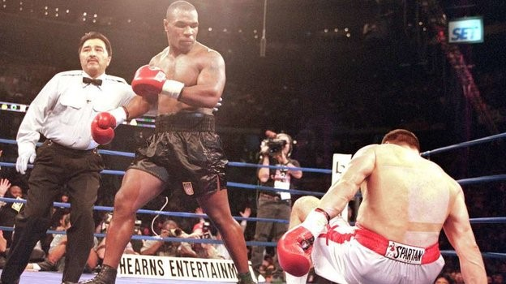

# Break

Assalomu aleykum ! Har bir inson bir yoki bir nechta boks janglarini ko’rgan bo’lsa kerak albatta! Sizlar shu janglarda raund tugaganda bokschilarga “break”, “break” deb ularni to’xtatganiga guvoh bo’lgan bo’lsangiz kerak albatta. Hozir biz siz bilan manashu “break” lar haqida gaplashamiz



Shu holatda anavi dabdalasi chiqqan bookschi shu so’zni intizorlik bilan kutadi. Va hakam “break” deb jangni to’xtatadi. Dasturlashda har bir kalit so’z amali bilan bog’liq demak bu yerda “break” so’zi jangni to’xtatsa dasturdagi “break” kalit so’zi siklni to’xtatadi.  
  
Ko’p gap eshshakka yuk, Dasturda misol ko’rishga o’tsak.

```csharp
using System;
namespace boks
{
    class Program
    {
        static void Main(string[] args)
        {
            int hakamSana = 0;
            while (true)
            {
                hakamSana++;
                Console.WriteLine(hakamSana);
                if (hakamSana == 10) break;
            }
        }
    }
}
```

Jangda Hakam 10 gacha sanab Jangni tugatishi kerak edi to’g’rimi?! Bu dasturda ham huddi shunday boldi cheksiz ishlaydigan siklni biz “break” kalit so’zi bilan to’xtatdik. Natijada Qora oynaga 1..10 oralig’ida sonlar chiqarildi. “Break”ni vazifasini ozroq tushundingiz deb o’ylayman. Yana bir dasturni ko’rsak.

```csharp
using System;
namespace boks
{
    class Program
    {
        static void Main(string[] args)
        {
            int hakamSana = 0;
            while (true)
            {
                int secund = 0;
                while (true)
                {
                    secund++;
                    if(secund > 3 * 60)
                    {
                        Console.WriteLine("Raund Tugadi!");
                        break;
                    }
                }
            }
        }
    }
}

```

Ko’rsatilgan dasturda siz raund tugash dasturini ko’rdingiz


Boksning 1 raundi 3 minut bo’ladi va 3\*60 secund bo’ladi. Bu dasturda siz boks raund tugashini avtamatlashtira oldingiz. Va for siklida second 180 ga teng bo’lganida “break” bu dasturni siklni to’xtatadi. Siz “switch” case ni o’rganayotganingizda ham break kalit so’zini ishlatgansiz!

```csharp
using System;
namespace boks
{
    class Program
    {
        static void Main(string[] args)
        {
            string EngZorBokschi = "Bill Geyts";
            switch (EngZorBokschi)
            {
                case "Bill Geyts":Console.WriteLine("Bill Geyts Milliarder"); break;
                case "Ozodbek Nazarbekov": Console.WriteLine("U Qo'shiqchi"); break;
                case "Ferrari": Console.WriteLine("U mashina"); break;
                case "Mayk Tayson": Console.WriteLine("Endi U qaridi"); break;
                case "Shahram G'iyosov": Console.WriteLine("To'g'ri"); break;
                default: Console.WriteLine("....");
                    break;
            }
        }
    }
}
```

Bu dasturga e’tibor bering bu dastur natijada “Bill Geyts Milliarder” Degan yozuv chiqadi va break kalit so’zi casening amalini to’xtatadi

