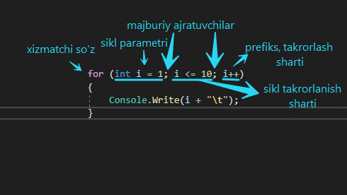

# For sikl operatori

Assalamu alaykum, mening internetdagi ajoyib zemlyaklarim. Galdagi mavzuda sizlarni takrorlash operatorlari haqida tanishtirib o’taman va shu bilan birgalikda For Loop operatorini ham ishlash sintaksisini ya'ni qanday ishlashini ko’rsataman

Umuman olganda kod yozayotganingizda bir xil hisoblash jarayonini qayta qayta yozish qimmatli vaqtingizni o'g'irlab sizni bezor qilishi mumkin, masalan siz “Salom, Dunyo!” jumlasini 100 marta yozishingiz zarur bo’lib qoldi. Siz uni qayta qayta yozib chiqgan bo’larmidingiz, yo’q albatta. Bu dasturchining asabini buzib, ko'ziga baloday ko'rsatib qo'yishi aniq. Aynan ushbu muammoning oldini olish uchun takrorlash operatorlari ishlab chiqilgan, ya’ni siz ta’kidlab o’tilgan jumlani bir necha qator kod bilan nafaqat 100 marta balkim googel marta ham yozishingiz mumkin. Googel bu eng katta son bo’lib, siz unga 1 soni qo’shsangiz, aynan ushbu sonni googel o’zlashtiradi. Siz o’zingiz uchun ulardan o’zingizga qulay bo’lganini tanlab olishingiz mumkin.

Takrorlash operatorining C\# da 4 xil turi mavjud:

•       For  
•       While  
•       Do-while  
•       foreach

foreach dan tashqari barcha operatorlar bir xil vazifani bajaradi, farqi ularning sintaksisida hisoblanadi, foreach ni ham albatta ko’rib o’tamiz

Keling endi For takrorlash operatori bilan tanishib chiqamiz:

For loop \(operatorining\) ishlash prinsipi quyidagicha

for \(o’zgaruvchi ; munosabat amallari ; postfiks\) { Operator yoki blok; \(yoki sikl tanasi\) }

Bu operator eng birinchi o’zgaruvchidan ishni boshlaydi, undan so’ng munosabat amallarini tekshiradi, har bir takrorlanish mobaynida u munosabat amallariga murojaat qiladi, agar munosabatlar to’g’ri bo’lsa operator yoki blokni bajaradi, postfiks esa undan so’ng bajariladi, agar noto’g’ri qiymatni olsa dasturimiz undan keyingi ya’ni operatorimizdan keyingi amallarni bajaradi yoki boshqa amallar yo’q bo’lsa, u to’xtaydi.

Masala: 1 dan 10 gacha bo’lgan sonlarni ko’rib chiqamiz:

```csharp
for(o’zgaruvchi ; munosabat amallari ; postfiks)
{
    Operator yoki blok; (yoki sikl tanasi)
}
```

Bu operator eng birinchi o’zgaruvchidan ishni boshlaydi, undan so’ng munosabat amallarini tekshiradi, har bir takrorlanish mobaynida u munosabat amallariga murojaat qiladi, agar munosabatlar to’g’ri bo’lsa operator yoki blokni bajaradi, postfiks esa undan so’ng bajariladi, agar noto’g’ri qiymatni olsa dasturimiz undan keyingi ya’ni operatorimizdan keyingi amallarni bajaradi yoki boshqa amallar yo’q bo’lsa, u to’xtaydi.

Masala: 1 dan 10 gacha bo’lgan sonlarni ko’rib chiqamiz:

```csharp
for(int i = 0; i <= 10; i++)
{
    Console.WriteLine(i + "\t");
}
```

Aynan ushbu 4 qator kod 100 marta yozishdan ko'ra yaxshiroq deb o'ylayman, sababini bilasiz!

Keling endi aynan ushbu kodni mulohaza qilamiz:



Bu yerda majburiy ajratuvchilar bo'lishi \(nuqta, vergul mana men shu yerdaman deyishi\)  shart, ularsiz biz for operatorida kod yoza olmaymiz \(tan olavering bari bir yoza olmaysiz\). Aynan ko’rsatilgan tartibda yozish ham shart emas. int i = 1 ni siklda tashqari holatlarda ham e’lon qilib sikl parametrini shunchaki i deb ham ketishimiz mumkin bo’ladi!

O'ylaymanki darsimiz qiziq bo'ldi va sizda hech qanday savol tug'ilmadi!!!

