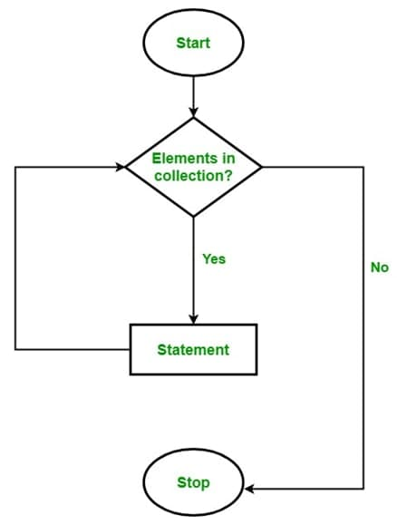

# Foreach sikl operatori

Assalomu aleykum bo‘lajak dasturchilar hozir sizlar bilan **foreach** sikli bilan tanishib chiqamiz. **foreach** siklining **for**, **while**, **do while** sikllaridan asosiy farqi **foreach** sikliga shart berilmaydi. Foreach sikli asosan massivlar va kolleksiya qiymatlari bilan ishlashni osonlashtirish uchun mo‘ljallangan bo‘lib, bunda massivning har bir elementiga undagi elementlar sonini bilmagan holda barcha elementlariga murojaat qilish imkonini beradi.

**foreach** blok sxemasi quydagicha:



```csharp
// Sintaksisi quyidagicha
foreach (var item in collection)
{
    // body
}

// O'zimizning tilda :)
foreach(<o`zgaruvchi turi> <o`zgaruvchi nomi> in <massiv nomi>)
{
    //Sikl tanasi
}
```


Bu yerda e’tibor qaratiladigan jihati o‘zgaruvchi turi massiv turi bilan mos kelishi lozim\(olmaning tagiga olma tushadi deganlaridek…☺\).

Ko'p gapirgandan ko'ra soddaroq misolda ko'rsak :\)\)\)


Biz avvaliga qiladigan ishimizni bilib olishimiz lozim, demak  biz qandaydir elementlarga ega massiv yaratamiz va foreach sikli orqali massiv elementlarini ekranga chiqaramiz.

```csharp
class Program
{
    static void Main(string[] args)
    {
        string[] mevalar = { "olma", "nok", "uzum", "shaftoli", "o`rik"};
        
        foreach (string meva in mevalar)
        {
            Console.WriteLine(meva);
        }
    }
}
```


Bu yerda biz **string** turidagi **mevalar** nomli massiv hosil qildik  va unga olma, nok, uzum, shaftoli, o\`rik qiymatlarini \(massiv elementlarini\) berib chiqdik.

Keyn esa foreach sikli string turidagi meva o’zgaruvchisiga mevalar massividagi elementlarini bitta-bitta olib uzatadi va har bir meva o’zgaruvchisini qiymatini ekranga chiqaramiz.

