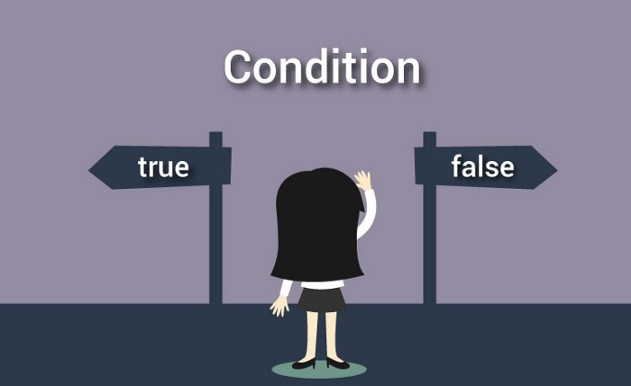

# If-else

C\# dasturlash tilida if-else lar bilan tanishamiz \(Men tanishman siz tanishasiz\) Biz hayotda juda ko’p if va else ni ishlatganmiz. “IF” so’zi o’zbek tiliga “Agar”  
deb tarjima qilinadi. Keling avval ifni o’zini o’rganib olaylik : Misol: “Agar bir qop pulim bo’lsa, albatta ularni hammasini yoqib yuborgan bo’lar edim”. Bu so’zda biz if ni o’zidan foydalandik demak keling uni C\# dasturlash tilida ko’ramiz.

```csharp
using System;
namespace MyProgram
{
    class Program
    {
        static void Main(string[] args)
        {
            bool meningBirQopPulim = false;
            if(meningBirQopPulim == true)
            {
                //Yoqib yuborgan bo'lar edim
            }
        }
    }
}

```

Demak Bu dasturda meningBirQopPulim degan o’zgaruvchi e’lon qildim, va bir qop  
pulim yo’qligi uchun false qiymat berdim. Endi esa ifga o’tamiz Dasturda avval “if” kalit so’zi yozib keyin qavslar orasiga shart beriladi, bu shart mantiqiy amallardan bolishi kerak ya’ni true yoki false qiymat qaytaradigan. Shuning uchun qavslar ichiga \(birQopPulim == true\) deb shart berdik, va bilib turganingizdek yolg’on yani false qiymat qaytaradi. Va shart bajarilmaydi. Natijada jingalak qavslar ichidagi codlar ish bajarmaydi. Endi bu Codelarni bizor o’zgartirsak, ya’ni meni biroz boyitsak

```text
using System;
namespace MyProgram
{
    class Program
    {
        static void Main(string[] args)
        {
            bool meningBirQopPulim = true;
            if(meningBirQopPulim == true)
            {
                Console.WriteLine("Yoqib yuborish kerak");
            }
        }
    }
}

```

Bu dasturda men men o’zimni bir qop pulim bor deb e’lon qildim va Dastur shartni tekshirib ko’radi e’tibor bering \(true\) qiymatga aylanayapti. Va natijada Console oynaga “yoqib yuborish kerak” degan satr chiqadi. Keling endi else ni ham ishlatamiz avval codeni bir ko’ring va ozroq fikr Yuritingchi.

```text
using System;
namespace MyProgram
{
    class Program
    {
        static void Main(string[] args)
        {
            bool meningBirQopPulim = true;
            if(meningBirQopPulim == true)
            {
                Console.WriteLine("Yoqib yuborish kerak");
            }
            else
            {
                Console.WriteLine("Tushingni borib suvga ayt!");
            }
        }
    }
}
```

Bu dasturda siz if-else ni strukturasini ko’rdingiz Bu structuraga dastur



Shunday qaraydi demak shart true bolsa chap tarafga false bo’lsa o’ng tarafga qarab ketadi. Bu yerda algoritm tarmoqlanayapti shundaymi. Yuqorida siz fikrlagan dastur natijasida Console oynaga “yoqib yuborish” kerak degan yozuv chiqadi yana bir qarang va fikrlab ko’ring. Hullas If kalit so’zidan keyin kelgan shart true bo’lsa if ning ichidagi jingalak qavslar ichidagi kod bajariladi, false bo’lsa else ning ichidagi jingalak qavslar ichidagi kod bajariladi. Hozir yozgan codelarimizni Jamlasak:

```text
using System;
namespace MyProgram
{
    class Program
    {
        static void Main(string[] args)
        {
            bool meningBirQopPulim = false;
            if(meningBirQopPulim)
            {
                Console.WriteLine("Yoqib yuborish kerak");
            }
            else
            {
                Console.WriteLine("Tushingni borib suvga ayt!");
            }
        }
    }
}
```

Natijada Console oynaga “Tushingni borib suvga ayt” degan so’z chiqadi. Sababi meningBirQopPulim o’zgaruvchi false qiymat oldi shuning uchun if shartidaga shu o’zgaruvchi nomi yetarli chunki o’zi false qiymat qaytarib turibdi. Yanada yaxshiroq tushunishingiz uchun bir nechta dasturlar ko’rsataman:

```text
using System;
namespace MyProgram
{
    class Program
    {
        static void Main(string[] args)
        {
            int getNumber = 0;
            if(getNumber == 0)
            {
                Console.WriteLine("Rost");
            }
            else
            {
                Console.WriteLine("Yolg'on")
            }
        }
    }
}

```

Natija: "Rost"

! Agar if yoki else ning operatori bitta bolsa jingalak qavslar shart emas!\(qoyilsa ham qoyilmasa ham to’g’ri\)

```text
using System;
namespace MyProgram
{
    class Program
    {
        static void Main(string[] args)
        {
            int DunyoMojizalari = 6;
            if (DunyoMojizalari == 7) Console.WriteLine("Hammasi joyida");
            else if (DunyoMojizalari < 7)
            {
                Console.WriteLine("Mo'jizalarda Kamchilik bor");
                Console.WriteLine("Aslida 7 ta bo'lish kerak edi");
            }
            else Console.WriteLine("Ko'payib ketdi");
        }
    }
}

```

Natija: Mo'jizalarda Kamchilik bor Aslida 7 ta bo'lish kerak edi Agar bu yerda qavslarni qo’ymaganimizda edi natija: “Mo'jizalarda Kamchilik bor” degan so’z chiqardi.

