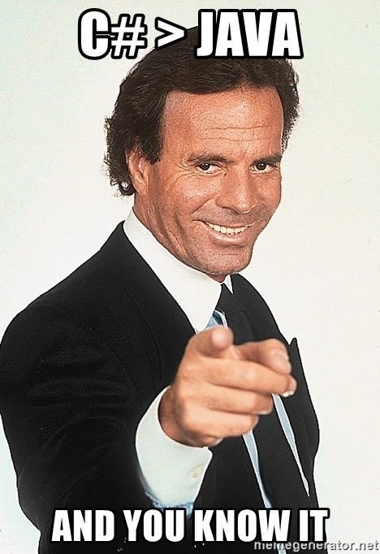

# Java vs C\#

**Siz bilishingiz kerak bo’lgan eng muhim faktlar!**   
  
Assalamu alaykum, bo’lajak C\# dasturchilari, galdagi mavzuyimizga xush kelibsiz. Umuman olganda har bir dasturlash tilining o’ziga yarasha ijobiy tomonlari, hamda mashuuuncha salbiy tomonlari mavjud. Hozir esa biz ulardan ikkitasini bir biriga solishtirib ko’ramiz, qaysi biri. C\# yoki Java?! Men barchasini ochiq oydin aytaman

Dastur tuzuvchi sifatida kelajagingizni aks ettira boshlaganingizda, ya’ni dasturlashni o’rganayotganingizda sizga bu juda qiyin savol bo’lish mumkin, qaysi biridan boshlaganim ma’qul? Har qanday tilni o’rganish uchun juda ko’p kuch, vaqt va sabr kerak bo’ladi \(to’g’risini aytgan yaxshida\).  
Ayni paytda Java dunyo bo’ylab eng mashxur texnologiyalardan biri bo’lib kelmoqda. Turli xil reytinglarda top 10 talikka kirgan til hisoblanadi. Balki Java dasturchilarining ham unga yopishib olishining sababi shudir. Bu til 1995-yili James Gosling ismli brat tomonidan ishlab chiqilgan. O’rganish nisbatan oson va ko’plab bepul o’quv manbalari mavjud. Undan Veb dasturlar va Mobil dasturlar uchun ko’p foydalanishadi. Sizning hozir Javaga ishqingiz ketdi, shoshmang hali silliq joyi turibdi. Javada kodlash uchun sizda litsenziya bo’lishi zarur. Agarda litsenziya bo’lmasa siz Oracle kompaniyaga $2000 dan ko'proq jarima to’lashga majbur bo’lasiz. Bundan tashqari ushbu dasturlash tilining kodlari ancha eskirgan, ya’ni zamonaviy trend darajadagi dasturlash tillariga nisbatan uning kodlari 20 yilga qarigan. Java tilini zamonaviylashtirish uchun yana bizga kamida 20 yil vaqt ketadi. Bundan tashqari kelajakda ham Java o’z mavqeyini saqlab qoladi deb o’ylamayman, sababi bizga yanada istiqbolli va yaxshiroq xizmat ko’rsatuvchi ochiq manbaa mavjud. Bu esa .NET Framework C\# dasturlash tili. Ushbu dasturlash tilida siz Javada qila olmagan ishlaringizni bemalol qila olasiz, Veb dasturlar va Mobil dasturlardan tashqari siz aynan C\# da Kompyuter o’yinlar, Kompyuter uchun dasturlar, Mikroservis, Machine Learning, Raspberry PI uchun kodlar….. xullas barcha barchasini qila olasiz.

Aytish kerak bo’lgan jihati yana shundaki C\# dasturlash tili 20 yil mobaynida muntazam ravishda rivojlanib kelmoqda, Javaga o’xshab yoshim o’tdi degani yo’q. Ha demay .NET Core 5 ham chiqadi. Bu esa rivojlanishining yaqqol isboti. Xo’sh, siz qay birini tanladingiz?

