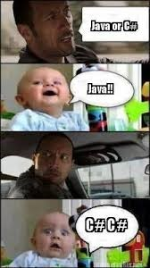

# Java vs C\#

**Siz bilishingiz kerak bo’lgan eng muhim faktlar!**   

  
Assalamu alaykum, bo’lajak C\# dasturchilari, galdagi mavzuyimizga xush kelibsiz. Bu mavzu ikki raqobatdosh tillari Java va C\# haqida, ularning ustunlik va kamchilik tomonlari haqida bo'ladi

Java Object-Oriented \(ob'ektga yo'naltirilgan\) va \(class-based\) klasslarga asoslangan dastrulash tilidir. Dasturchilar Javada bir marta kod yozishadi, har qanday joyda \(run\) ishlata olishadi. Java \(source\) manba kodlarini, Java kompilyatori uni \(bytecode\) bayt kodlarga o'zgartiradi va keyinchalik ushbu kompilyatsiya qilingan bayt kod JRE \(Java Runtime Environment\) yordamida istalgan operatsion tizimda ishlash imkoniyatini beradi.

C\# ham \(Object-Oriented\) ob'ektga yo'naltirilgan, funksional, \(generic and component-oriented\)  generic va komponentlarga yo'naltirilgan asosiy tillardan hisoblanadi. OOP, funksiya va generic tiplar haqida [Essential \(muhim\)](https://dot-net.uz/basic/essential) bo'limimizda o'qishingiz mumkin. Bu til turli xil dasturlarni tuzish uchun ishlatilinadi. Windows operatsion tizimida \(windows application\) windows dasturlarini tuzishda va o'yinlarini yasashda ushbu til absolyutno kuchli til hisoblanadi. Veb-ishlab chiqishni C\# yordamida ham samarali bajarish mumkin va u mobil ishlanmalar uchun tobora ommalashib bormoqda.

### Birma-bir taqqoslaymiz!

Quyida Java va C\# o'rtasidagi eng yaxshi 8 taqqoslashlar keltirilgan:

<table>
  <thead>
    <tr>
      <th style="text-align:left">Taqqos</th>
      <th style="text-align:left">Java</th>
      <th style="text-align:left">C#</th>
    </tr>
  </thead>
  <tbody>
    <tr>
      <td style="text-align:left">
        <ol>
          <li>Paradigma</li>
        </ol>
      </td>
      <td style="text-align:left">Sinflarga asoslangan, C++ dan olingan Ob&apos;ektga yo&apos;naltirilgan
        til</td>
      <td style="text-align:left">Ob&apos;ektga yo&apos;naltirilgan, komponentlarga yo&apos;naltirilgan,
        funktsional</td>
    </tr>
    <tr>
      <td style="text-align:left">2. Dastur</td>
      <td style="text-align:left">Murakkab veb-ga asoslangan, yuqori darajada bir vaqtda qo&apos;llaniladigan
        dastur</td>
      <td style="text-align:left">Veb, o&apos;yin va mobil dasturlashda eng ommabop tillar qatorida</td>
    </tr>
    <tr>
      <td style="text-align:left">3. Project (loyiha)</td>
      <td style="text-align:left">Murakkab veb-asosidagi loyihalar uchun javob beradi</td>
      <td style="text-align:left">Game development loyihalari uchun eng mos til</td>
    </tr>
    <tr>
      <td style="text-align:left">4. Foydalanish</td>
      <td style="text-align:left">Turli xil chatlar, veb-dasturlar uchun foydalaniladi</td>
      <td style="text-align:left">Mobil va kompyute o&apos;yinlar, VM (Virtual Reality) uchun eng maqbul
        til</td>
    </tr>
    <tr>
      <td style="text-align:left">5. O&apos;rnatish</td>
      <td style="text-align:left">JDK (Java Development Kit) talab qiladi</td>
      <td style="text-align:left">.NET farameworki C# tomonidan ishlatiladigan kodlarning katta kutubxonasini
        taqdim etadi.</td>
    </tr>
    <tr>
      <td style="text-align:left">6. Qo&apos;llanish sohasi</td>
      <td style="text-align:left">C# ga taqqoslaganda, Java ushbu jihatini takomillashtirishi kerak deb
        o&apos;ylayman</td>
      <td style="text-align:left">Yaxshi dasturiy asosga ega bo&apos;lgan server tili</td>
    </tr>
    <tr>
      <td style="text-align:left">7. Tools</td>
      <td style="text-align:left">Eclipse, NetBeans, IntelliJ IDEA, Android Studio</td>
      <td style="text-align:left">Visual Studio, VS Code, SharpDevelop, JetBrains Rider va boshqalar</td>
    </tr>
  </tbody>
</table>

> Umuman olganda sizga u yoki bu tilni tanlang demayman. Shunchaki bu ikki tilning ustunlik tomonlari va ba'zi kamchiliklarini ko'rsatib o'tdim. Anglashimiz kerak bo'lgan jihati shundaki, siz o'zingiz tanlagan sohada qaysi til kuchliroq ekanligini bilib olishdir!!!!

