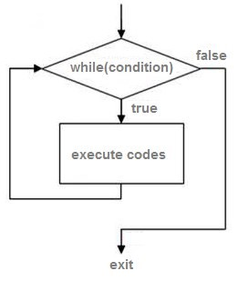

# While sikl operatori

Assalomu alaykum azizlar. Sizlar bilan takrorlash operatorlaridan \(C\# dasturlash tili deb yozib o’tirmayman\) while va do-while bilan tanishamiz\(tanishasiz ,mayli men ham qayta tanisharman, o’ylab ko’ray ok?\). Xo’p bo’lmasa ketdik. while ham xuddi for singari takrorlash operatori. Buni bilganlar darmonda, bilmaganlar o’sha gap. Umumiy tuzilishi while\(shart\){operatorlar} while\(shart\) { Operatorlar; } bu while operatori zab ajoyibda. Ajoyibligi shuki har safar shartni tekshiradi. Agar true bo’lsa while ichidagi operatorlarni bajaradi. Agar false bo’lsa while ichida shuncha yozgan kodiyizni bir tiyinga olmaydida darrov keying amalga o’tadi. Masalan oddiy “salom” so’zini 10 marta yozmoqchimiz. Buning uchun quyidagicha kod kiritamiz

```csharp
int i = 1;
while(i<10)
{
  Console.WriteLine("salom");
  i = i + 1;
}
```

Ko’rib turganingizdek while ishimiz ancha osonlashadi. Bu while operatorini ifni akasi desak ham bo’ladi. Faqat else qismi yo’q xolos, ammo yaxshi tarafi sikl bajaradi. Endi siz bilan yana bir misol ko’ramiz.

```csharp
while(true)
{
    Console.WriteLine("salom");
}
```

Ana bu rosa zo’r bo’ldi. Endi bu sikl hech qachon tugamaydi. Ehh salomdan boshi chiqmay qoldi kimni bo’lsa ham



