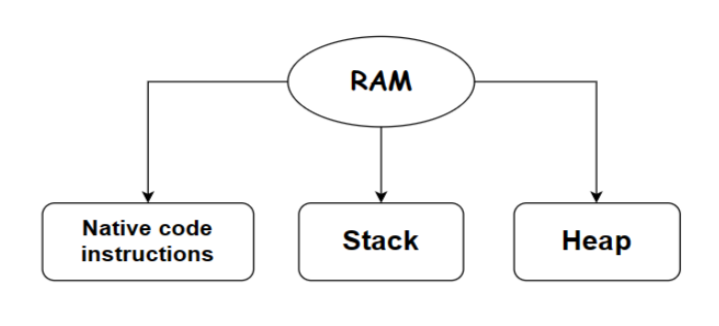
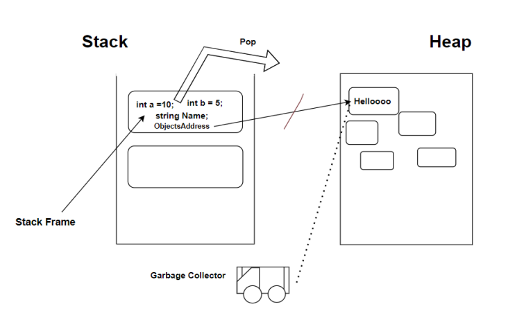
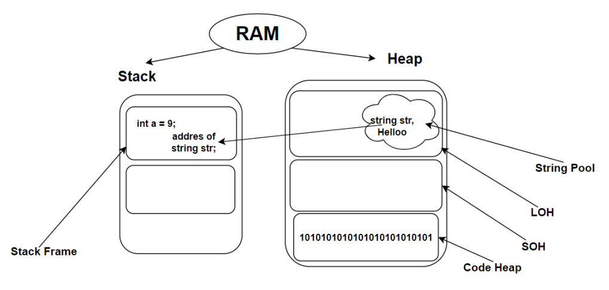

# Stack & Heap  

Assalomu alaykum, biz hozir dasturingiz run bo‘lganda, xotira bilan bog'liq umumiy qanday jarayonlar ketishi haqida sal chuqurroq yoritib berishga harakat qilamiz.

**RAM** => Random access memory, biz bilgan o‘sha tezkor xotira. Dastur ishga tushganda, dasturda foydalanilgan vaqtinchalik ma’lumotlar shu qismda saqlanadi. **CLR** xotirani oson boshqarishi uchun, xotirani ba’zi qismlarga ajratadi:

1. **Stack** - bu ma’lumotlarni **LIFO** ko‘rinishida saqlovchi ma’lumotlar tuzilmasi;

2.  **Heap** - bu xotiraning dynamic memory allocation’ga javob beradigan qismi;

3.  **Native** Code Instructions - bu mashina tiliga mos bo‘lgan code saqlanadigan xotiraning bir qismi;

### Keling, birinchi **Stack** nima ekanligi haqida gaplashamiz :)

**Stack** => Xotiraning bu qismi asosan local o‘zgaruvchilarni saqlashga va method chaqiruvlarini boshqarishga xizmat qiladi. Unda ma’lumot qo‘shish va o‘chirish judayam tez bo‘ladi. Stack har bir method call qilinganda o‘sha method uchun mahsus **Stack Frame** yaratadi va bu jarayon **CallStack** deb ataladi. 

Stack Frame o‘zi nima? 

**Stack Frame** => Dasturning runtime’da har bitta call qilingan method’lar uchun alohida alohida bir biridan **izolyatsiyalangan** Stack Frame’lar yaratiladi, va method’dagi **local** o‘zgaruvchilar, code’ning qaysi qismi, qaysi qatori haqidagi address shu Stack Frame’da saqlanadi. Refence type’li, yoki **global** o‘zgaruvchi bo‘lsa, o‘zi Heap’da joylashadi va address'i shu Stack Frame'ga reference qilib qo‘yiladi. Method o‘z ishini yakunlasa, Stack Frame Stack’dan **Pop** qilinadi, ya’ni tozaladi. 

### **Global** va **local** o‘zgaruvchi deb nima nazarda tutildi?

Aynan bu **Global** o‘zgaruvchi deyilganda, bir necha method’larda qayta qayta ishlatilishi mumkin bo‘lgan reference va value type’ga mansub o‘zgaruvchilar nazarda tutildi. Xususan, class’ning property, field’lari, .. va hokazo.

**Local** o‘zgaruvchi deb esa, faqat aynan shu method’da ishlatilgan, va method o'z ishini tugatsa, uning ham yashash vaqti tugaydigan o‘zgaruvchilarga aytilgan. Value type bo‘lgan method parametr’lari, .. va hokazo.

Ya’ni, value type’ga mansub o'zgaruvchilar qayerda yaratilishiga qarab xotira tanlaydi. Unuting, "value type’li o'zgaruvchilar faqat Stack’da joylashadi" degan gapni :)

Nega value type’li o'zgaruvchilar Heap’da ham joylashishi kerak? Nega Stack’da joylashavermaydi ular?

Bir value type’ga doir bo‘lgan o‘zgaruvchi Heap’da joylashishi uchun u bir nechta method’larda bir necha marta ishlatilishi kerak bo‘ladi. Yuqorida aytganimday, Stack Frame’lar bir biridan izolyatsiyalangan bo‘ladi. Bu shuni anglatadiki, siz birinchi method’da ishlatilgan o‘zgaruvchingizni ikkinchi method’da ishlata olmaysiz. Shu sababdan global value type bo‘lgan o‘zgaruvchilar ham Heap’da saqlanadi, har qaysi Stack Frame uchun uni address’i reference qilib qo‘yiladi va bu sizga sizning Global o‘zgaruvchingizni istalgan method’ingizda, istalgan marotaba ishlatish imkonini beradi.

### Stack’dan Stack Frame’ni **Pop** qilish jarayoni qanday bo‘ladi?

Yuqorida aytganimdek, Method o‘z ishini yakunlasa, Stack Frame’ham Stack’dan Pop qilinadi va shu bilan birgalikda, method’da ishlatilgan local va global o‘zgaruvchilar ham xotiradan tozaladi. Local o‘zgaruvchilar birdaniga Stack Frame’dan tozalanadi. Global o‘zgaruvchilar esa Heap’da saqlanib turibdi desak, bu holatda Global o‘zgaruvchini Stack Frame’dan reference’i uziladi, ya’ni qiymati null’ga tenglanadi. Heap’ni atrofini davomli ravishda aylanib yuruvchi o‘sha mashhur **Garbage Collector** refernce’i uzilgan ma’lumotlarni qidirib yuradi, va ularni tez-tez tozalab turadi. Agar bunday bo'lmaganda(tozalamagan taqdirida), **Memory Leak**(keraksiz ma’lumotlar to‘lib ketishi)ga olib kelar edi.

Local value type'ni stack'da saqlanishiga doir istisnolar:

1. **Anonim Funksiyalar**

2. **Asinxron Funksiyalar**, shu holatda local o‘zgaruvchimiz ham Heap’da vaqtinchalikka joylashib turadi, Stack Frame Pop bo‘lsa, GC borib, o‘zgaruvchini ham Heap'dan tozalab yuboradi.

### Endi navbat **Heap**’ga keldi)

**Heap** => Xotiraning bu qismida obyektlar va reference type'ga tegishli ma'lumotlar saqlanadi, qiymati Heap'da, address’lari esa Stack’da saqlab boriladi. U address’ga reference qilib qo‘yiladi. 

Lekin bu hali hammasi emas, keling sal chuqurroq yondashamiz)

Heap o‘zi nima uchun yaratilgan? Bizga Stack’ni o‘zi yetmasmidi?

Bu yerda shuni aytish joizki, Heap’ning asosiy ustunlik taraflari ma’lumotlarni betartib holatda joylashtirishi(unlimited joy), collection’larni boshidagi object’ni **root reference** qila olishidir. 

Aytaylik, bizdagi Stack Frame’da global reference tip bo‘lgan o‘zgaruvchimiz bor, va u collection, agar uni boshqa Stack Frame’ga copy qilmoqchi bo‘lsak elementlarini bitta bitta o‘tkazib chiqishga to‘g‘ri kelar edi. Heap bor bo‘lganligi uchun shunchaki o‘sha collection’ning root reference’i ulab qo‘yiladi xolos)

Heap’ning mavzuga doir tashkil topgan qismlarini aytib o'taman:

1. **LOH** => Large Object Heap(85 000 baytdan katta bo‘lgan ma’lumotli o‘zgaruvchilar saqlanadi)

2. **SOH** => Small Object Heap(85 000 baytdan kichik bo‘lgan ma’lumotli o‘zgaruvchilar saqlanadi) 

3. **Code Heap**(0,1’lar saqlanadi :))

LOH va SOH’lar **Managed Heap** deya yuritiladi.

LOH’ning ichidan **String pool** ham o‘rin olgan hisoblanadi.

Bu safargi, Heap va Stack xotira yuzasidan olib borgan kichik chuqurlashuvimiz shulardan iborat edi, e'tiboringiz uchun rahmat)

