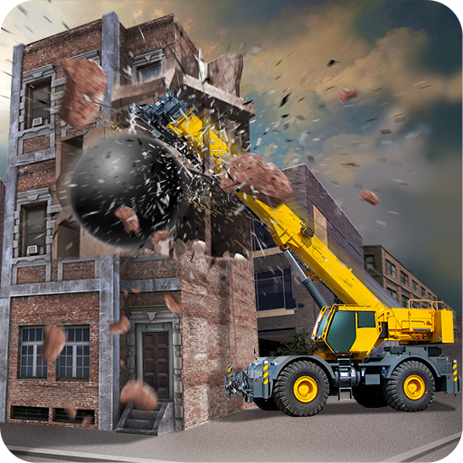

# Destructor

Destructor - bu shunday methodki, ortiq kerak bo'lmaydigan classlarni destroy \(o'chirish\) qilishga imkon beradi. Ya'ni bir necha bor ishlatilingan classlarga bizning boshqa ehtiyojimiz bo'lmasa, uni destroy qiladi. Bu method .NET Framework Garbage collectoridan bilvosita chaqiriladi va shu sababli dasturchiga uni chaqirishga \(invoke\) aslo hojat qolmaydi. Qachonki o'zgaruvchilar va ob'ektlar \(objects\) reachable \(erishish mumkin bo'lmasa -- bu yerda o'zgaruvchi va ob'ektlarni ishlata olishimiz nazarda tutilayapti ;\) \) bo'lmasa, ularni destruct \(o'chirish\) qilishimiz mumkin.


Agar shundayam tushunmagan bo'lsangiz, unda sodda tilda tushuntiraman, Constructor qandaydir vazifani build \(qurish\)bajarishga asoslangan method bo'lsa, Destructor destroy \(buzish\) qilishga asoslanadi.



### Shularni bilmasangiz bo'lmaydi!

* Har bir classda destructorlarni bir marta e'lon qilish mumkin
* Bu method qiymat qaytarmaydi \(return\) va classning nomi bilan bir xil nomlanadi
* Bu method [constructor](https://docs.dot-net.uz/c-.net/basic/essential/konstruktor)lardan alohida ajratib olingan method, sababi uni nomlashda oldiga Tilda symbol \(~\) qo'yiladi
* Destructor gitara narsa, unga na [parametr](https://docs.dot-net.uz/c-.net/basic/essential/parametrlar), na [access modifier](https://docs.dot-net.uz/c-.net/basic/essential/modifikatorlarga-ruxsat-berish) kerak
* Destructorlar [structure](https://docs.dot-net.uz/c-.net/basic/essential/struct)larda ishlamaydi, faqatgina classlarga xos bo'lgan method
* [Overload \(qayta yuklash\)](https://docs.dot-net.uz/c-.net/basic/essential/overload-qayta-yuklash) yoki [inherit \(voris\)](https://docs.dot-net.uz/c-.net/basic/essential/vorislik) qilinmaydi
* Ob'ektning base classida destructor Finalize method \(dasturni tugallash methodi\) sifatida chaqiriladi

```csharp
class NimaGap
{ 
   // Bir nechta ishlar
   // O'zgaruvchi o'zgarmas va boshqalar

   // Destructor
   ~Misol()
    {
        // Yana qandaydir kodlar
    }
}
```

### **Misol**

```csharp
using System;
class Program
{
     static void Main(string[] args)
     {
         int yil = int.Parse(Console.ReadLine());

         Details();
         GC.Collect();
         Console.ReadLine();

     }
     public static void Details()
     {
         User user = new User();
     }
}

class User
{
     public User()
     {
         Console.WriteLine("Created");
     }
     ~User()
     {
         Console.WriteLine("Destroyed");
     }
}
```

```csharp
OUTPUT:
    inputdan so'ng
    Created
    Destroyed
```

Bu misolda, destructor nima ekanligini va qanday ishlashini ko'rdik!

