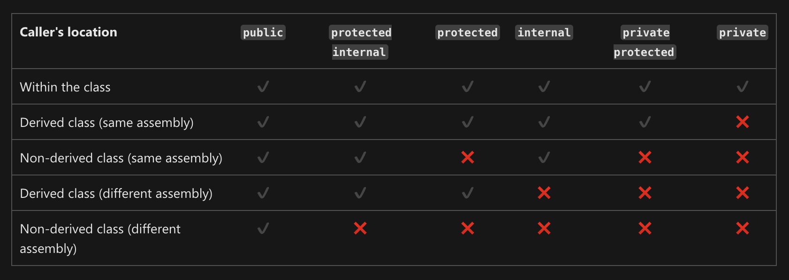
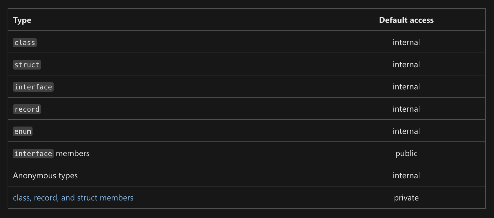

## Ruxsat modifikatorlari
**Ruxsat modifikatorlari** - class, record, struct, interface va uning a'zolari, enum-ga qo'shiladigan kalit so'zlar bo'lib, ularning ko'rinishini va asosan ulardan qayerda foydalanish mumkinligini belgilaydi. Ushbu kalit so'zlar bizga inkapsulyatsiyani saqlashga va tasodifiy o'zgarishlarning oldini olishga yordam beradi, shu bilan kodimizni toza va xavfsiz saqlaydi.

## Ahamiyati
Ruxsat modifikatorlaridan strategik foydalanish quyidagi sabablarga ko'ra C# da juda muhim:

- Bu yaxshi tuzilgan kodni ta'minlab, inkapsulyatsiya tamoyillariga rioya qilishga yordam beradi.
- Bu obyektning ichki holatini qasddan o'zgartirishning oldini oladi.
- U ilovaning turli qatlamlari o'rtasida qanday foydalanishni belgilab beradi.

Shunday qilib, ruxsat modifikatorlarining kuchidan foydalanishga tayyormisiz? Keling, har xil turlarni ko'rib chiqaylik!

## Turlari
C# har biri o'ziga xos funksionallikka ega bo'lgan oltita ruxsat modifikatorini taklif qiladi. Keling bularga kirishdan oldin _solution_ va _csproj_ degan tushunchalarga oydinlik kiritsak.
- **solution** - Visual Studio-da dastur yaratishda yoki boshqa C# loyihasini boshlashda ishlatiladi. Solution, bir yoki bir nechta proyektlarni birlashtiradi. Agar sizning loyihangizda bir nechta proyektlar (masalan, web ilovalar, desktop ilovalar, test proyektlar...) bo'lsa, ularni bir-biriga bog'lash va bir bosh sahifa orqali barchasiga nazorat qilish uchun solution yaratishimiz mumkin.
- **csproj** - har bir C# proyekti, u tilda joylashgan direktoriyada joylashgan, proyektning asosiy fayli csproj fayli orqali nazorat qilinadi. Bu faylda proyektning qanday ma'lumotlarni, qaysi fayllarni, klasslarni, boshqa proyektlar bilan bog'lanishni, ilova versiyasini va ko'p boshqa sozlamalarni o'z ichiga olgan. Csproj fayli, proyekt yaratish, tarqatish va ishga tushirish jarayonlarini boshqarish uchun ishlatiladi.

Agar siz bitta loyihadagi bir nechta proyektlarni birlashtirishni xohlasangiz, siz barchasini o'z ichiga oladigan bir solution fayli yaratishingiz mumkin. Solution fayli sizning barcha proyektlaringizni boshqarish, ular orasida aylanish va ularga qo'shimcha sozlamalar qo'shish imkoniyatini beradi.

Masalan, bir loyihaning tuzilishi quyidagicha ko'rinadi:

```
MySolution/
  ├── MyConsoleApp/
  │     ├── Program.cs
  │     └── MyConsoleApp.csproj
  ├── MyLibrary/
  │     ├── MyClass.cs
  │     └── MyLibrary.csproj
  └── MySolution.sln
```

Bu yerda **MySolution.sln** - bu solution fayli, **MyConsoleApp.csproj** va **MyLibrary.csproj** - bu esa proyektlarning csproj fayllari.




### public
**public** (umumiy ruxsat modifikatori) - bu kalit so'z orqali yaratilgan class, record, struct, interface va uning a'zolarini butun _solution_ bo'yicha ishlatishga ruxsat beradi. Ya'ni biz solution ichidagi hamma proyektlarda  ishlatish imkoniga ega bo'lamiz

```csharp
public class Hayvon
{
  public string Nom; // Umumiy ruxsat modifikatori ishlatilgan.

  public void Gapir()
  {
    Console.WriteLine("Salom, mening ismim " + Nom);
  }
}

class Program
{
  static void Main(string[] args)
  {
    Hayvon meningHayvonim = new Hayvon();

    // "Nom" umumiy a'zosiga shu yerdan kirishingiz mumkin.
    meningHayvonim.Nom = "Oybola";
    meningHayvonim.Gapir(); // Chiqish: Salom, mening ismim Oybola
  }
}
```

### internal
**internal** (ichki ruxsat modifikatori) - bu kalit so'z orqali yaratilgan class, record, struct, interface va uning a'zolarini butun proyekt bo'yicha ishlatishimiz mumkin bo'ladi. _Solution_ dagi boshqa proyektlarda foydalana olmaymiz.

Keling bitta _BirinchiDastur_ degan proyekt yaratamiz va unda bitta sinf yaratamiz:

```csharp
namespace BirinchiDastur;

public class Nuqta
{
  internal int x;
  internal int y;

  public Nuqta Namuna()
  {
    Nuqta p = new Nuqta();
    return p;
  }
}

```

Yuqorida `Nuqta` nomli sinf yaratdik. Uning `x`  va `y` degan xususiyatlariga `internal` ruxsat modifikatori berilgan. Va `Namuna` nomli metod yaratdik. Bu metod bizga shu sinfdan namuna olib qaytaradi.

Ana endi shu yaratgan sinfimizni boshqa proyektdan turib ishlatmoqchi bo'lsak quyidagicha ko'rinishda bo'ladi:

```csharp
using BirinchiDastur;

class BoshqaDastur
{
  static void Main()
  {
    Nuqta nuqta = new Nuqta();
    nuqta.Namuna();

    //Console.WriteLine(nuqta.x); // Kompilyatsiya vaqtida xato
    // "Nuqta.x" ga himoya darajasi tufayli kirish imkonsiz
  }
}
```

Ya'ni, Nuqta sinfining `x` va `y` xususiyatlari `internal` bo'lganligi uchun ham uni boshqa proyektda ishlatishga ruxsat yo'q. Lekin Nuqta sinfining `Namuna` nomli metodi public bo'lganligi uchun bemalol ishlatish imkoniyatiga egamiz. 


### protected
**protected** (himoyalangan ruxsat modifikatori) - bu kalit so'z orqali yaratilgan class (yoki record) a'zolarini shu class(yoki record) dan voris olingan class (yoki record) ichidagina foydalanishimiz mumkin. 

```csharp
class Hayvon
{
  protected string tovush; // Himoyalangan ruxsat modifikatori ishlatilgan.

  public Hayvon(string hayvonTovushi)
  {
    tovush = hayvonTovushi;
  }
}

class It : Hayvon
{
  public It(string itTovushi) : base(itTovushi) { }

  public void Vovilla()
  {
    Console.WriteLine("It deydi " + tovush); // Biz ushbu olingan sinfdagi himoyalangan a'zo "tovush" ga kira olamiz.
  }
}

class Program
{
  static void Main(string[] args)
  {
    It meningItim = new It("Vav!");
    meningItim.Vovilla(); // Chiqish: It deydi Vav!
  }
}
```

### private
**private** (shaxsiy ruxsat modifikatori) - bu kalit so'z orqali yaratilgan class, record, struct va uning a'zolarini faqat shu class, record, struct-ning ichidagina foydalanish huquqini beradi. (Interface a'zolari uchun bu ruxsat modifikatorini qo'llay olmaymiz.)

```csharp
class Hayvon
{
  private int yosh; // Shaxsiy ruxsat modifikatori ishlatilgan.

  public void YoshniOrnat(int yangiYosh)
  {
    yosh = yangiYosh;
  }

  public int YoshniOl()
  {
    return yosh;
  }
}

class Program
{
  static void Main(string[] args)
  {
    Hayvon meningHayvonim = new Hayvon();

    // Siz to'g'ridan-to'g'ri boshqa sinfdan "age" shaxsiy a'zosiga kira olmaysiz.
    // myAnimal.age = 4; // Bu kompilyatsiya vaqtida xatolikka olib keladi.

    // Buning o'rniga, shaxsiy a'zolarga kirish uchun umumiy ruxsat etilgan metodlardan foydalanishingiz kerak.
    meningHayvonim.YoshniOrnat(4);
    Console.WriteLine("Yosh: " + meningHayvonim.YoshniOl()); // Chiqish: Yosh: 4
  }
}
```

### protected internal
**protected internal** (himoyalangan ichki ruxsat modifikatori) - bu kalit so'z orqali yaratilgan class, record, interface va ularning a'zolarini shu va boshqa proyektda shu class, record yoki interface dan voris olgandagina ishlatish imkonini beradi.

Keling yuqorida yaratgan _Nuqta_ nomli sinfimizga o'zgartirish kiritsak:

```csharp
namespace BirinchiDastur;

public class Nuqta
{
  protected internal int x;
  protected internal int y;

  public Nuqta Namuna()
  {
    Nuqta p = new Nuqta();
    return p;
  }
}

```

Yuqorida `x` va `y` nomli xususiyatlarimizga `protected internal` ruxsat modifikatorini berdik.

Uni _BoshqaDastur_ nomli proyektimizda quyidagicha ishlatishimiz mumkin:

```csharp
using BirinchiDastur;

class BoshqaDastur: Nuqta
{
  static void Main()
  {
    Nuqta nuqta = new Nuqta();
    nuqta.Namuna();

    //Console.WriteLine(nuqta.x); // Kompilyatsiya vaqtida xato
    // "Nuqta.x" ga himoya darajasi tufayli kirish imkonsiz

    BoshqaDastur boshqaDastur = new BoshqaDastur();
    boshqaDastur.Namuna();

    Console.WriteLine(boshqaDastur.x);
    Console.WriteLine(boshqaDastur.y);
  }
}
```

Ya'ni, Nuqta sinfining `x` va `y` xususiyatlari `protected internal` bo'lganligi uchun ham uni boshqa proyektda to'ridan-to'g'ri ishlata olmaymiz. Kompilyatsiya vaqtida xatolik qaytaradi. Lekin Nuqta nomli sinfimizdan voris oladigan bo'lsak va uning vorisidan namuna olsak, `protected internal` ruxsat modifikatori ana o'sha namunada `x` va `y` nomli xususiyatlarimizni ishlatishga imkon beradi.

### private protected
**private protected** (himoyalangan shaxsiy ruxsat modifikatori) - bu kalit so'z orqali yaratilgan class, record, interface va ularning a'zolarini shu proyektda, shu class, record, interface-dan voris olgandagina ishlatish imkonini beradi.

Bunda _Nuqta_ nomli sinfimiz quyidagi holatga keladi:

```csharp
namespace BirinchiDastur;

public class Nuqta
{
  private protected int x;
  private protected int y;

  public Nuqta Namuna()
  {
    Nuqta p = new Nuqta();
    return p;
  }
}

class TogriChiziq: Nuqta
{ 
  public TogriChiziq(int x, int y)
  {
    this.x = x;
    this.y = y;
  }
}
```

Yuqorida _Nuqta_ nomli sinf joylashgan proyektda _‌TogriChiziq_ nomli yangi sinf yaratdik va _Nuqta_ sinfidan voris oldik. Shu holatda _Nuqta_ sinfining `x` va `y` xususiyatlaridan foydalanishimiz mumkin bo'ladi

Ana endi shu yaratgan sinfimizni boshqa proyektdan turib ishlatmoqchi bo'lsak quyidagicha ko'rinishda bo'ladi:

```csharp
class BoshqaDastur : Nuqta
{
  static void Main()
  {
    Nuqta nuqta = new Nuqta();
    nuqta.Namuna();

    //Console.WriteLine(nuqta.x); // "Nuqta.x" ga himoya darajasi tufayli kirish imkonsiz

    BoshqaDastur boshqaDastur = new BoshqaDastur();
    boshqaDastur.Namuna();

    //Console.WriteLine(boshqaDastur.x); // "Nuqta.x" ga himoya darajasi tufayli kirish imkonsiz
    //Console.WriteLine(boshqaDastur.y); // "Nuqta.x" ga himoya darajasi tufayli kirish imkonsiz
  }
}
```

Ya'ni, Nuqta sinfining `x` va `y` xususiyatlari `private protected` bo'lganligi uchun ham uni boshqa proyektda ishlatishga ruxsat yo'q.

## Standart ruxsat modifikatori
Agar biz enum va class, record, struct, interface va ularning a'zolariga hech qanday ruxsat modifikatorlarini qo'llamasak, ular avvalboshdan o'rnatilgan ruxsat modifikatorlarini qabul qiladi. Ular quyidagi jadvalda aks ettirilgan:




