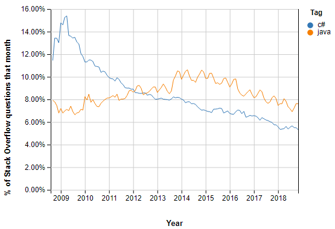

# Java vs C\#

**Siz bilishingiz kerak bo’lgan eng muhim faktlar!** \
****

 (1).png>)


Techempower linki:

[https://www.techempower.com/benchmarks/#section=data-r20\&hw=ph\&test=plaintext](https://www.techempower.com/benchmarks/#section=data-r20\&hw=ph\&test=plaintext)


\
Assalamu alaykum, bo’lajak C# dasturchilari, galdagi mavzuyimizga xush kelibsiz. Bu mavzu ikki raqobatdosh tillari Java va C# haqida, ularning ustunlik va kamchilik tomonlari haqida bo'ladi.

Java Object-Oriented (ob'ektga yo'naltirilgan) va (class-based) klasslarga asoslangan dastrulash tilidir. Dasturchilar Javada bir marta kod yozishadi, har qanday joyda (run) ishlata olishadi. Java (source) manba kodlarini, Java kompilyatori uni (bytecode) bayt kodlarga o'zgartiradi va keyinchalik ushbu kompilyatsiya qilingan bayt kod JRE (Java Runtime Environment) yordamida istalgan operatsion tizimda ishlash imkoniyatini beradi.

C# ham (Object-Oriented) ob'ektga yo'naltirilgan, funksional, (generic and component-oriented)  generic va komponentlarga yo'naltirilgan asosiy tillardan hisoblanadi. OOP, funksiya va generic tiplar haqida [Essential (muhim)](https://dot-net.uz/basic/essential) bo'limimizda o'qishingiz mumkin. Bu til turli xil dasturlarni tuzish uchun ishlatilinadi. Windows operatsion tizimida (windows application) windows dasturlarini tuzishda va o'yinlarini yasashda ushbu til absolyutno kuchli til hisoblanadi. Veb-ishlab chiqishni C# yordamida ham samarali bajarish mumkin va u mobil ishlanmalar uchun tobora ommalashib bormoqda.

### Birma-bir taqqoslaymiz!

Quyida Java va C# o'rtasidagi eng yaxshi 7 taqqoslashlar keltirilgan:

> ASOSIY FARQLARI
>
> * Java Java Runtime Environment (JRE) da ishlaydi, C# esa Common Language Runtime (CLR) da ishlashga mo'ljallangan.
> * Java class-based ya'ni klasslarga asoslangan Ob'ektga yo'naltirilgan til, C# esa Ob'ektga yo'naltirilgan, funksional va komponentlarga yo'naltirilgan til!
> * Java operatorning yuklanishini qo'llab-quvvatlamaydi, C# esa bir nechta operatorlar uchun operatorning yuklanishini ta'minlaydi.
> * Java pointers (ko'rsatgichlar)ni qo'llab-quvvatlamaydi, C# esa faqat xavfli rejimda qo'llab-quvvatlaydi.
> * Javada massivlar Object kutubxonasiga tegishli bo'lsa, C# da massivlar System kutubxonasiga tegishli

| Xususiyatlari                                    | Java                                                                                                    | C#                                                                                              |
| ------------------------------------------------ | ------------------------------------------------------------------------------------------------------- | ----------------------------------------------------------------------------------------------- |
| Ishlab chiqarilishi                              | Sun Microsystems tomonidan ishlab chiqilgan                                                             | Microsoft .NET ning bir qismi sifatida ishlab chiqilgan                                         |
| Ecosystem                                        | Ulkan ochiq manbali kod tizimiga ega                                                                    | Microsoft platformalari uchun dasturiy ta'minotni ishlab chiqish uchun foydalaniladi            |
| Delegatlar                                       | Delegatlarga o'xshagan funksiyalarga erishish uchun interfeysdan foydalanishni talab qiladi             | C# o'zining metod sifatida xizmat qiladigan delegatlari mavjud                                  |
| Istisno holatlari (code reviewing)               | Istisno faqat bitta turga ega                                                                           | Tekshirilgan va tekshirilmagan istisnolarni ajratib turadi                                      |
| Goto                                             | Java ushbu operatorni qo'llab quvvatlamaydi                                                             | C# ushbu operatorni qo'llab quvvatlaydi                                                         |
| Polymorphism                                     | Asosiy sinfda "virtual" kalit so'zni chaqiradi va olingan sinfda "bekor qilish" kalit so'zini ishlatadi | Odatiy holat bo'yicha polimorfizmni yoqadi. By default                                          |
| Xavfsizlik                                       | Himoyalangan                                                                                            | Himoyalanmagan                                                                                  |
| Qo'shimcha kompilyatsiyani qo'llab quvvatlaydimi | Java qo'shimcha kompilyatsiyani qo'llab quvvatlamaydi                                                   | C# protsessor ko'rsatmalari yordamida qo'shimcha kompilyatsiya xususiyatini qo'llab-quvvatlaydi |
| Cross-platform                                   | Java o'zining baytkodi bilan yetarlicha kross-platforma hisoblanadi                                     | C# ham kross-platforma, lekin Javaga taqqoslaganda, C# bu xususiyatini rivojlantirishi zarur    |
| IDE                                              | Eclipse, NetBeans, IntelliJ IEDA                                                                        | Visual Studio, MonoDevelop, #Develop, VS Code                                                   |
| Runtime                                          | Java JVM (Java Virtual Machine) yordamida kodni ishga tushiradi                                         | C# CLR (Common Language Runtime) yordamida kodni ishga tushiradi                                |
| O'rtacha ish haqi                                | 2020 - yilga ko'ra Java dasturchilari o'rtacha yiliga $102, 633 ishlab topishadi                        | 2020 - yilga ko'ra C# dasturchilari yiliga $108, 145 ishlashadi                                 |

### Javaning ustunlik tomonlari

1. To'liq har bir Java kodlari detallarigacha tushuntirib berilgan.
2. Dasturchilarning ma'lum bir qismi, ya'ni dasturchilarning ko'proq qismini Java mutaxasislari tashkil etadi.
3. Java bir vaqtning o'zida ko'plab vazifalarni bajarishga imkon beradigan ko'p tarmoqli muhitga ega.
4. Kutubxonalarni boshqarish juda oson.

### C# ning ustunlik tomonlari

1. Tegishli lambda va genericlarni qo'llab-quvvatlaydi.
2. Microsoft Corporation tomonidan qo'llab-quvvatlangan. (O'sha mashhuuur kompaniya).
3. Avtomatik tarzda keraksiz kodlarni ajratadi. Warning deb chiqadi.
4. Maydonlar get va set metodlari bilan birga keladi. Bu esa C# da kod yozishni yanada osonlashtiradi.
5. Xotirani avtomatik boshqarish imkoni bor.

### Javaning kamchiliklari

1. JIT kompilyatori dasturni nisbatan sekinlashtiradi.
2. Java yuqori xotira va ishlash talablariga ega. Bu esa qimmat hardware kerak degani.
3. Pointers kabi past darajadagi dasturiy tuzilmalarni qo'llab-quvvatlamaydi.
4. Javada keraksiz kodlar ustida hech qanday nazorat yo'q, chunki Java delete(), free() kabi funksiyalarni o'z ichiga olmaydi.

### C# ning kamchiliklari

1. C# .NET frameworkining internal qismidir, shuning uchun dasturni ishlaydigan server Windowsga asoslangan bo'lishi kerak.
2. C# moslashuvchan emas, chunki u asosan .NET frameworkiga bog'liq.

