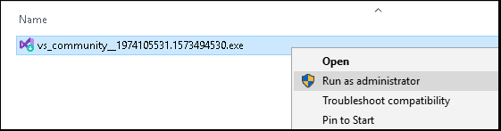
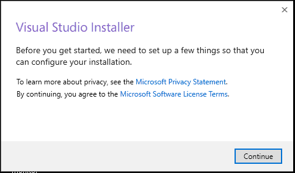
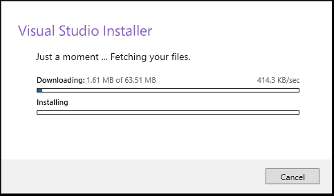

# Kirish

Dasturchi sifatida bizni tanlaganingizdan juda xursandmiz (mendan tashqari yana bir nechta maqolalar tayyorlagan akalarim ham). Ushbu darsdan boshlab siz C# tilini o’rganishni boshlaysiz!!!

## C# tilida nimalar qilsa bo'ladi, to'liq ma'lumot bering?!

Mobil dasturlar\
O'yinlar (kompyuter/mobil)\
Desktop dasturlar\
Ma'lumotlar bazasi uchun dasturlar\
Veb dasturlar\
Veb servislar\
VR - Virtual Reality uchun dasturlar\
Veb saytlar

## Nimada boshlashim mumkin?

Birinchi qiladigan vazifamiz kod yozish uchun muhit yuklab olish va uni o’rnatish hisoblanadi. Chunki muhitsiz siz hech narsa qila olmaysiz. Bizga kerak bo’lgan muhit esa Visual Studio 2019 nomli editor.\
Uni bu yerdan topasiz:\
Windows: [https://visualstudio.microsoft.com/vs/preview/](https://visualstudio.microsoft.com/vs/preview/)\
Mac:[https://docs.microsoft.com/en-us/visualstudio/releasenotes/vs2019-mac-relnotes](https://docs.microsoft.com/en-us/visualstudio/releasenotes/vs2019-mac-relnotes)

 (1) (1) (1) (1) (2) (2) (2) (2) (1) (1) (1) (1) (1) (1) (1) (1) (1) (1) (1).png>)

Qizil chiziq ichidagi knopkani bosasiz. So’ngra fayllar orasidan installation (o’rnatuvchi dasturini) topib **Run as administrator** ni bosib, ishga tushirasiz.








## Muharrirda new project/новый проект hosil qilish!


```csharp
Console.WriteLine("E'tiboringiz uchun atdushi raxmat!:)))");
```
