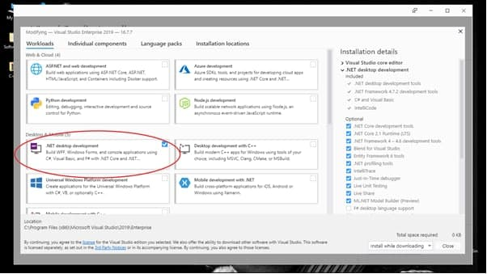
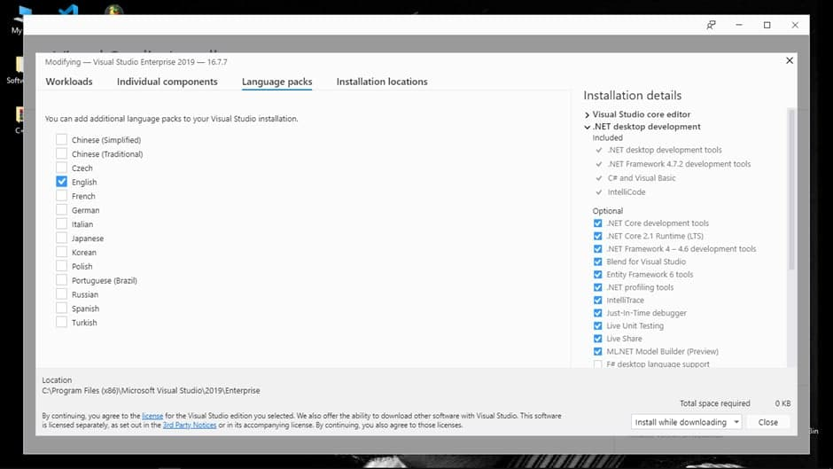
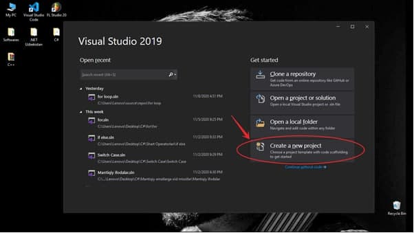
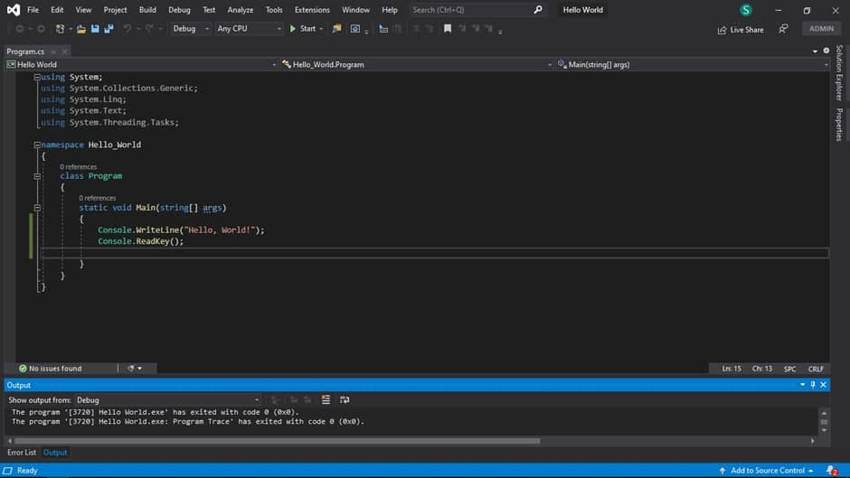

# Kirish

Assalomu alaykum, hurmatli yurtdoshlar. Dasturchi sifatida bizni tanlaganingizdan juda xursandmiz \(mendan tashqari yana bir nechta maqolalar tayyorlagan akalarim ham\). Ushbu darsdan boshlab siz C\# tilini o’rganishni boshlaysiz!!!

## C\# tilida nimalar qilsa bo'ladi, to'liq ma'lumot bering?!

Mobil dasturlar  
O'yinlar \(kompyuter/mobil\)  
Desktop dasturlar  
Ma'lumotlar bazasi uchun dasturlar  
Veb dasturlar  
Veb servislar  
VR - Virtual Reality uchun dasturlar  
Veb saytlar

## Nimada boshlashim mumkin?


Birinchi qiladigan vazifamiz kod yozish uchun muhit yuklab olish va uni o’rnatish hisoblanadi. Chunki muhitsiz siz hech narsa qila olmaysiz. Bizga kerak bo’lgan muhit esa Visual Studio 2019 nomli editor.   
Uni bu yerdan topasiz:  
    Windows: [https://visualstudio.microsoft.com/vs/preview/](https://visualstudio.microsoft.com/vs/preview/)  
    Mac:[https://docs.microsoft.com/en-us/visualstudio/releasenotes/vs2019-mac-relnotes](https://docs.microsoft.com/en-us/visualstudio/releasenotes/vs2019-mac-relnotes)


Qizil chiziq ichidagi knopkani bosasiz. So’ngra fayllar orasidan installation \(o’rnatuvchi dasturini\) topib **Run as administrator** ni bosib, ishga tushirasiz.






## Muharrirda new project/новый проект hosil qilish!




![Birinchi strelka yaratmoqchi bo&#x2019;lgan faylingizning nomi hisoblanadi, buni xohlagancha nomlashingiz mumkin. Ikkinchi strelkada esa faylingizni kompyuterning qaysi fayl ichiga joylayotganini ko&#x2019;rsatgan. Uchinchi strelkada esa .NET Frameworkining oxirgi versiyasi ko&#x2019;rsatilgan. Rasmda ko&#x2019;rsatilgan versiyasi esa oxirgi versiya hisoblanadi va men ham aynan ushbu versiyasini ishlatishni maslahat beraman. Chunki avvalgi versiyalariga qaraganda ko&#x2019;proq imkoniyatlariga ega.](../../../.gitbook/assets/photo_2020-11-11_19-49-06.jpg)



```csharp
Console.WriteLine("E'tiboringiz uchun atdushi raxmat!:)))");
```

