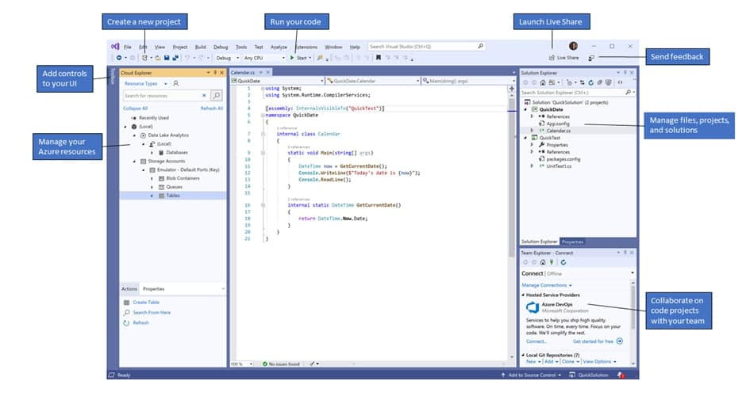
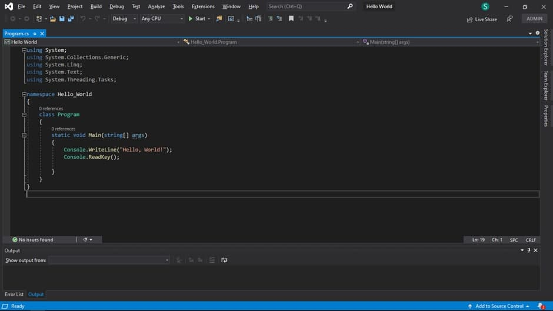

# Visual Studio 2019

Ushbu maqolada sizga Visual Studio 2019 matn muharriri bilan tanishtirib chiqaman!

Oldingi maqolam uni qanday yuklab olish va o’rnatish haqida edi, bu maqola esa uni qanday ishlatish haqida

Ushbu muharrir kompilyatorlarni, kodlarni to’ldirish uchun muhitlarni va yana ko’plab hususiyatlarni o’z ichiga oladi. Bundan tashqari ushbu muharrirda ko’pgina grafik dizaynlar qilsak ham bo’ladi \(kompyuter va mobil dasturlar dizayni\).

## Boshladik unda!!!

*  Create a new project – yangi fayl yaratish.
*  Run your code – kodingizni ishga tushirish.
* Launch Live Share – Ijtimoiy tarmoqlarda jonli efir qilish.
* Send feedback – Mulohazalar yuborish \(qo’shimcha fikrlar bildirish\).
* Add control to your UI – UI dizayningizni nazorat qilish.
* Manage files, projects, solutions – Fayllar, Loyihalar, Mashqlarni boshqarish.
* Collaborate on code projects with your team – Jamoa bilan kod loyihalarda ishlash.
* Manage your Azure resources – Azure resurslaringizni boshqaring.

1. Solution Explorer – Bu sizga kod fayllarini ko’rish, navigatsiya qilish va boshqarish imkonini beradi. Bundan tashqari siz bu menyu orqali kodingizni tartibga solishingiz mumkin.
2. The Editor Window – Bu joyda siz kodlashingiz, dasturingizni dizaynini chizishingiz mumkin \(bu yerda u Program.cs deb nomlangan\).
3. Team Explorer – Bunda Git va TFVC platormalarida loyihalar bilan tanishish va boshqalar bilan loyihangizni baham ko’rish imkonini beradi

### Qolgan parametrlarni keyinchalik o'zingiz kod yozish mobaynida bilib boraverasiz, ularni tushuntirib o'tirishga hojat ham yo'q, barchasi oddiy va elementer funksiyalar!

> E'tiboringiz uchun raxmat!!!:\)\)\)

