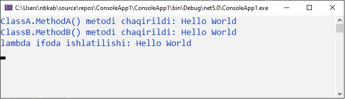
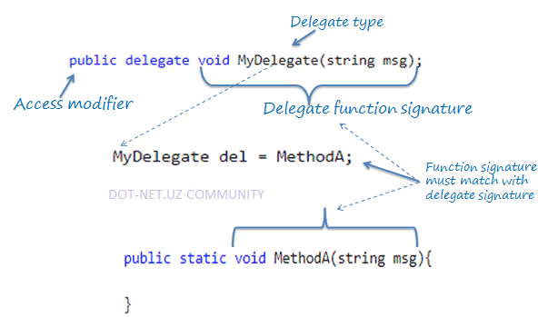

# Delegatlar

_Agar funksiyani parametr sifatida uzatishni xohlasak nima bo'ladi?
Qanday qilib C# callback funksiyalari yoki event larni boshqaradi?_

Javob: **Delegat**

**Delegat** - bu metod imzosini belgilaydigan ma'lumot turi. Siz boshqa ma'lumotlar turi kabi delegatning o'zgaruvchilarini yaratishingiz mumkin va ular yordamida delegat bilan bir xil parametrga ega har qanday metodga murojaat qilishingiz mumkin.

Delegatlar bilan ishlashda uchta bosqich mavjud:

1. Delegatni e'lon qiling

2. Kerakli metodni o'rnating

3. Delegatni chaqiring

Delegat quyida ko'rsatilgandek , **_delegate_** kalit so'zdan keyin funksiya imzosi yordamida e'lon qilinishi mumkin:

```csharp
[ruxsat modifikatori] delegate [qaytariluvchi tip] [delegat nomi]([parameterlar])
```

Quyida **MyDelegate** deb nomlangan delegat e'lon qilingan:

```csharp
public delegate void MyDelegate(string msg);
```
Yuqorida biz void tipidagi va string parametrli MyDelegate delegatini e'lon qildik. Delegat sinfdan tashqarida yoki sinf ichida e'lon qilinishi mumkin. Quyidagi misolda, bu sinfdan tashqarida e'lon qilamiz.

```csharp
using System;
namespace Delegate
{
    class Program
    {
        // delegat e'lon qilish
        public delegate void MyDelegate(string msg); 
        
        public static void Main(string[] args)
        {
            // delegat obyektiga metod tayinlash
            MyDelegate del1 = new MyDelegate(MethodA);

            // delegat obyektiga metod tayinlash
            MyDelegate del2 = MethodA;
        
            //lyambda ifodadan foydalanish
            MyDelegate del3 = (string msg) => Console.WriteLine(msg);
            
            Console.ReadKey();
        }
        
        //metodni e'lon qilish
        static void MethodA(string message)
        {
            Console.WriteLine(message);
        }
    }
}
```

Kerakli metodni o'rnatgandan so'ng, Invoke() metodi yordamida yoki () operator yordamida delegat chaqirilishi mumkin.

```csharp
del.Invoke("Hello World!");
// or 
del("Hello World!");
```

Quyida delegat qo'llanishining to'liq namunasi keltirilgan:

```csharp
using System;
namespace Delegate
{
    public delegate void MyDelegate(string msg);

    class Program
    {
        static void Main(string[] args)
        {
            MyDelegate del = ClassA.MethodA;
            del("Hello World");

            del = ClassB.MethodB;
            del("Hello World");

            del = (string msg) => Console.WriteLine("lambda ifoda ishlatilishi: " + msg);
            del("Hello World");

            Console.ReadKey();
        }
    }
    class ClassA
    {
        public static void MethodA(string message)
        {
            Console.WriteLine("ClassA.MethodA() metodi chaqirildi: " + message);
        }
    }
    class ClassB
    {
        public static void MethodB(string message)
        {
            Console.WriteLine("ClassB.MethodB() metodi chaqirildi: " + message);
        }
    }
}
```
**Natija:**



Quyidagi rasm delegatni tasvirlaydi:



**_Delegatni Parametr sifatida uzatish_**
Metod quyida ko'rsatilgandek, Delegat turi parametriga ega bo'lishi mumkin:

```csharp
using System;
namespace Delegate
{
    public delegate void MyDelegate(string msg);

    class Program
    {
        static void Main(string[] args)
        {
            MyDelegate del = ClassA.MethodA;
            InvokeDelegate(del);

            del = ClassB.MethodB;
            InvokeDelegate(del);

            del = (string msg) => Console.WriteLine("Lambda ifodaning ishlatilishi: " + msg);
            InvokeDelegate(del);
        }
        static void InvokeDelegate(MyDelegate del) // MyDelegate parametr turi
        {
            del("Hello World");
        }
    }
    class ClassA
    {
        public static void MethodA(string message)
        {
            Console.WriteLine("ClassA.MethodA() metodi chaqirildi: " + message);
        }
    }
    class ClassB
    {
        public static void MethodB(string message)
        {
            Console.WriteLine("ClassB.MethodB() metodi chaqirildi: " + message);
        }
    }
}
```

**_Multicast delegati_**
Delegat bir nechta metodlarni ko'rsatishi mumkin. Bir nechta metodni ko'rsatadigan delegat ko'p tarmoqli delegat deb ataladi. "+" Yoki "+ =" operatori chaqiruvlar ro'yxatiga funksiyani qo'shadi va "-" va "-=" operatorlari uni o'chirib tashlaydi.

```csharp
using System;
namespace Delegate
{
    public delegate void MyDelegate(string msg);

    class Program
    {
        static void Main(string[] args)
        {
            MyDelegate del1 = ClassA.MethodA;
            MyDelegate del2 = ClassB.MethodB;

            MyDelegate del = del1 + del2;
            del("Hello World");

            MyDelegate del3 = (string msg) => Console.WriteLine("Lambda ifoda ishlatilishi: " + msg);
            del += del3;
            del("Hello World");

            del = del - del2;
            del("Hello World");

            del -= del1;
            del("Hello World");

            Console.ReadKey();
        }
    }
    class ClassA
    {
        public static void MethodA(string message)
        {
            Console.WriteLine("ClassA.MethodA() metodi chaqirildi: " + message);
        }
    }
    class ClassB
    {
        public static void MethodB(string message)
        {
            Console.WriteLine("ClassB.MethodB() metodi chaqirildi: " + message);
        }
    }
}
```

**Natija:**


Qo'shish va olib tashlash operatorlari har doim topshiriqning bir qismi sifatida ishlaydi: del1 += del2; ayirboshlashga aynan teng del1 = del1+del2; va shunga o'xshashdir.

Agar delegat qiymatni qaytaradigan bo'lsa, unda ko'p sonli delegat chaqirilganda oxirgi tayinlangan maqsad metodining qiymati qaytariladi.

```csharp
using System;
namespace Delegate
{
    public delegate int MyDelegate();

    class Program
    {
        static void Main(string[] args)
        {
            MyDelegate del1 = ClassA.MethodA;
            MyDelegate del2 = ClassB.MethodB;

            MyDelegate del = del1 + del2;
            Console.WriteLine(del()); //Ekranga 200 chiqadi

            Console.ReadKey();
        }
    }
    class ClassA
    {
        public static int MethodA()
        {
            return 100;
        }
    }
    class ClassB
    {
        public static int MethodB()
        {
            return 200;
        }
    }
}
```

**_Umumiy delegat_**
Umumiy delegatni delegat bilan bir xil tarzda aniqlash mumkin, lekin umumiy turdagi parametrlardan yoki qaytish turidan foydalangan holda. Maqsadli metodni o'rnatganingizda umumiy tur ko'rsatilishi kerak.

Masalan, int va string parametrlari uchun ishlatiladigan quyidagi umumiy delegatni ko'rib chiqamiz:
```csharp
using System;
namespace Delegate
{
    public delegate T add<T>(T param1, T param2);

    class Program
    {
        static void Main(string[] args)
        {
            add<int> sum = Sum;
            Console.WriteLine(sum(10, 20));

            add<string> con = Concat;
            Console.WriteLine(con("Hello ", "World!!"));

            Console.ReadKey();
        }
        public static int Sum(int val1, int val2)
        {
            return val1 + val2;
        }
        public static string Concat(string str1, string str2)
        {
            return str1 + str2;
        }
    }
}
```

**Natija:**


