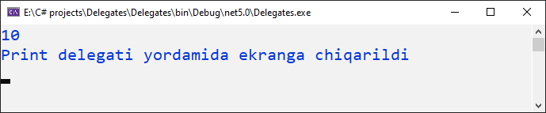
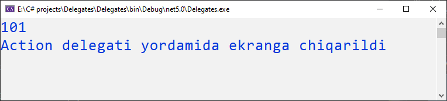

# Action delegati

**Action** delegati bu - [**Func**](https://docs.dot-net.uz/c-.net/basic/yuqori-daraja/delegatlar/func-delegati) kabi System nomlar fazosi tarkibiga kiruvchi umumiy delegatdir.
**Action** delegati tuzilish jihatidan **Func** delegatiga o'xshash, lekin **Action** delegatida hech qanday parametr qaytarilmaydi. Shuning uchun **Action** delegati void tipli metodlar bilan ishlatiladi.

Masalan, quyidagi delegat int qiymatini ekranga chiqaradi:

```csharp
using System;

namespace Delegates
{
    class Program
    {
        public delegate void Print(int val);

        static void ConsolePrint(int i)
        {
            Console.WriteLine(i);
            Console.WriteLine("Print delegati yordamida ekranga chiqarildi");
        }

        static void Main(string[] args)
        {
            Print del_print = ConsolePrint;
            del_print(10);

            Console.ReadKey();
        }
    }
}
```

Natija:


Endi xuddi shu metodni **Action** delegati yordamida ishlatib ko'ramiz:

```csharp
using System;

namespace Delegates
{
    class Program
    {
        static void ConsolePrint(int i)
        {
            Console.WriteLine(i);
            Console.WriteLine("Action delegati yordamida ekranga chiqarildi");
        }

        static void Main(string[] args)
        {
            Action<int> act_print = ConsolePrint;
            act_print(101);

            Console.ReadKey();
        }
    }
}
```

Natija:


Shu joyiga kelganda kallamni ichida qisqa tutashuv bo'lib simi tegib ketdi shekilli bir qiziq savol keb qoldi:

_Hali action delegati bilan, hali boshqa delegat bilan ishlatayotgan metodni o'ziga hech e'tibor berdingizmi? ConsolePrint metodining vazifasi nima? ConsolePrint metodini chaqirsam u baraka topkur Console.WriteLine metodini chaqiryapti. Ha qovun ConsolePrint ni ovora qilmasdan, to'g'ridan to'g'ri Console.WriteLine ga murojaat qilsam bo'lmaydimi?_

Xullas, yuz marta savol bergandan bir marta sinab ko'rgan yaxshi:

```csharp
using System;

namespace Delegates
{
    public delegate void Print(string i);
    public class Func3Example
    {
        public static void Main()
        {          
            Action<int> print = Console.WriteLine;
            print(12);

            Print del_print = Console.WriteLine;
            del_print("Xullas, bunaqasiyam ishlorakan ;)");

            Console.ReadKey();
        }
    }
}
```

Natija:


**Action** delegatini new kalit so'zi yordamida ham e'lon qilish mumkin:

```csharp
Action<int> print = new Action<int>(Console.WriteLine);
```


**Action** delegati 16 tagacha har xil turdagi kirish parametrlarini qabul qilishi mumkin.


**Action** delagatining anonim metod bilan qo'llanishi:

```csharp
static void Main(string[] args)
{
    Action<int> printActionDel = delegate(int i)
                                {
                                    Console.WriteLine(i);
                                };

    printActionDel(10);
}
```

**Action** delegatining lyambda ifoda bilan qo'llanishi:

```csharp
static void Main(string[] args)
{
    Action<int> printActionDel = i => Console.WriteLine(i);
       
    printActionDel(10);
}
```


**Action va Func delegatlarining afzalliklari**
* Delegatlarni aniqlash oson va tez.
* Kodni qisqa qiladi.
* Ilova davomida mos keladigan tip.


_**Shunday qilib, Action delegati tiplari bilan qiymat qaytarmaydigan har qanday metoddan foydalanishingiz mumkin.**_
