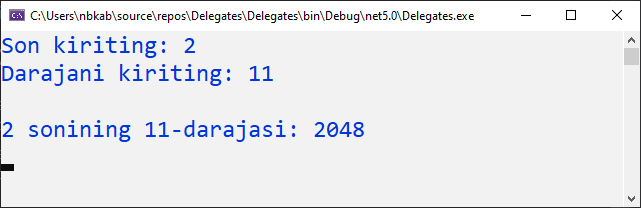

# Anonim metodlar

_Yuqoridagi [Func](https://docs.dot-net.uz/c-.net/basic/yuqori-daraja/delegatlar/func-delegati), [Action](https://docs.dot-net.uz/c-.net/basic/yuqori-daraja/delegatlar/action-delegati) va [Predicate](https://docs.dot-net.uz/c-.net/basic/yuqori-daraja/delegatlar/predicate-delegati) mavzularida ushbu delegatlarning anonim metod bilan qo'llanishini ko'rdik, lekin anonim metod qanday ekanligi haqida endi  gaplashamiz._😊

Nomidan ko'rinib turibdiki, **Anonim metod** - bu ismsiz metod. U metod bo'lsa, delegatlar mavzusida nima qilyapti degan savol tug'ilishi mumkin.  Buning sababi shundaki, **Anonim metod** delegat tushunchasi bilan chambarchas bog'liq va delegatlarni chaqirish uchun ishlatiladi.


Qisqacha qilib aytganda metodlarni nima deb nomlashni bilmasdan nom qidirgan paytingizda: _"keling endi shu metodni benom qoldiramiz"_ deb yordamga keladi.


**Anonim metod** umumiy ko'rinishi:




Anonim metoddan foydalanish uchun quyidagi qadamlarni bajarish yetarli:
* Delegat e'lon qilish
* Delegatdan obyekt hosil qilish
* _delegate_ kalit so'zi yordamida hosil qilingan obyektga mos nomsiz metod yozish(bunda metod parametrlari delegat parametrlariga mos bo'lishi kerak)
* delegatdan foydalanish


Misol:

```csharp
using System;

namespace Delegates
{
    class Program
    {
        //delegat e'lon qilish
        public delegate void Print(string s);
        static void Main(string[] args)
        {
            //delegatdan obyekt hosil qilib unga anonim metod tayinlash
            Print p;
            p = delegate (string str)
            {
                Console.WriteLine($"Hello {str}");
            };

            //delegatni chaqirish
            p("DOT-NET.UZ");

            Console.ReadKey();
        }
    }
}

```
