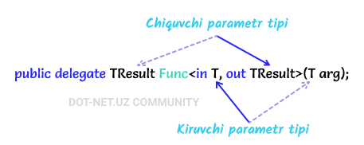

# Func delegati

_Ko'p hollarda maxsus delegatlarni qo'lda belgilashga hojat qolmasligi uchun C\# tarkibiga umumiy delegat turlari **Func** va **Action** kiritilgan._

**Func** bu - System nomlar fazosiga kiritilgan umumiy delegatdir va u parametrlari bo'lmagan metodni kapsulaga soladi va parametr bilan ko'rsatilgan turdagi qiymatni qaytaradi. Bunda nol yoki undan ortiq kirish parametrlari va bitta chiqish parametri mavjud hisoblanib, oxirgi parametr har doim chiqish parametri sifatida bo'ladi. Func delegati parametrlari <> (burchakli qavs) lar ichida ko'rsatiladi.

Bitta kirish va chiqish parametriga ega Func delegatining umumiy ko'rinishi:

Ikkita kirish va chiqish parametriga ega Func delegatining umumiy ko'rinishi:

**..information not finished yet 🙃..**

