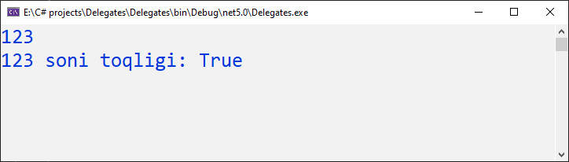
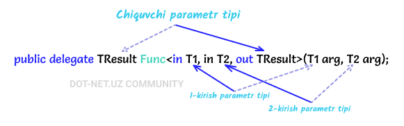
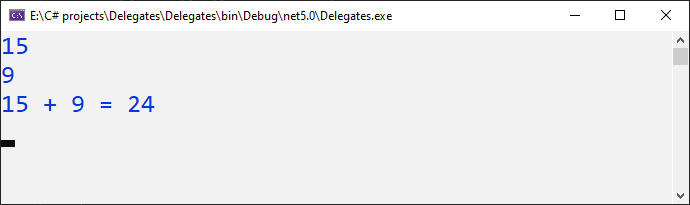
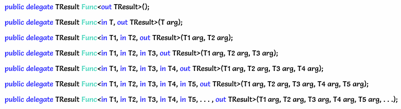

# Func delegati

_Ko'p hollarda maxsus delegatlarni qo'lda belgilashga hojat qolmasligi uchun C\# tarkibiga umumiy delegat turlari **Func** va **Action** kiritilgan._

**Func** bu - System nomlar fazosiga kiritilgan umumiy delegatdir va u parametrlari bo'lmagan metodni kapsulaga soladi va parametr bilan ko'rsatilgan turdagi qiymatni qaytaradi. Bunda nol yoki undan ortiq kirish parametrlari va bitta chiqish parametri mavjud hisoblanib, oxirgi parametr har doim chiqish parametri sifatida bo'ladi. **Func** delegati parametrlari **<>** (burchakli qavs)lar ichida ko'rsatiladi.

Bitta kirish va chiqish parametriga ega **Func** delegatining umumiy ko'rinishi:


Misol:
```csharp
using System;

namespace Delegates
{
    class Program
    {
        static void Main(string[] args)
        {
            //delegatga metod tayinlash
            Func<int, bool> add = IsOdd;

            //son kiritish
            int number = int.Parse(Console.ReadLine());

            //delegatni ishlatish va natijani o'zlashtirish
            bool result = add(number);

            //natijani ekranga chiqarish
            Console.WriteLine($"{number} soni toqligi: {result}");

            Console.ReadKey();
        }

        //sonni toqlikka tekshiruvchi metod
        static bool IsOdd(int a)
        {
            return a % 2 == 1;
        }
    }
}
```

Natija:



Ikkita kirish va chiqish parametriga ega **Func** delegatining umumiy ko'rinishi:



Misol:

```csharp
using System;

namespace Delegates
{
    class Program
    {
        static void Main(string[] args)
        {
            //delegatga metod tayinlash
            Func<int, int, int> add = Summ;

            //sonlarni kiritish
            int number1 = int.Parse(Console.ReadLine());
            int number2 = int.Parse(Console.ReadLine());

            //delegatni ishlatish va natijani o'zlashtirish
            int result = add(number1, number2);

            //natijani ekranga chiqarish
            Console.WriteLine($"{number1} + {number2} = {result}");

            Console.ReadLine();
        }

        //Ikkita sonni yig'indisini qaytaruvchi metod
        static int Summ(int a, int b)
        {
            return a + b;
        }
    }
}
```

Natija:



Yuqoridagi misollardan tashqari **Func** delegati maksimal 16 tagacha kirish parametrlarini qabul qilishi mumkin:



_**Func** delegatining anonim metod bilan qo'llanishi:_

```csharp
Func<int> getRandomNumber = delegate()
                            {
                                Random rnd = new Random();
                                return rnd.Next(1, 100);
                            };
```

_**Func** delegatining anonim metod bilan qo'llanishi:_

```csharp
    Func<int> getRandomNumber = () => new Random().Next(1, 100);
//yoki
    Func<int, int, int>  Sum  = (x, y) => x + y;
```
