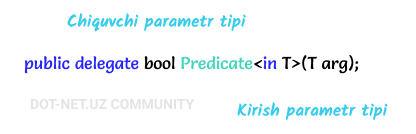

# Predicate delegati

**Predicate** delegati bu - [**Func**](https://docs.dot-net.uz/c-.net/basic/yuqori-daraja/delegatlar/func-delegati) va [**Action**](https://docs.dot-net.uz/c-.net/basic/yuqori-daraja/delegatlar/action-delegati) kabi System nomlar fazosi tarkibiga kiruvchi umumiy delegatdir. U ma'lum bir qoidalar(shartlar) to'plamini o'z ichiga olgan metodni ifodalaydi va berilgan parametrni ushbu qoidalarga mos kelishini tekshiradi. **Predicate** delegati bitta kirish parametri hamda bool qiymatidagi bitta chiqish parametriga ega.

**Predicate** delegatining umumiy ko'rinishi:

