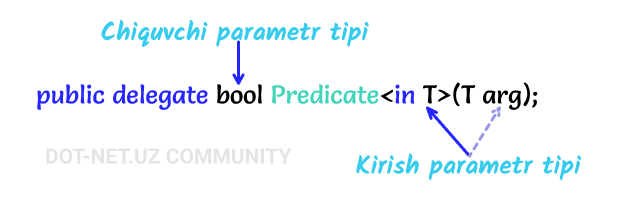
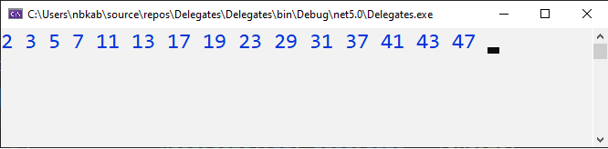

# Predicate delegati

**Predicate** delegati bu - [**Func**](https://docs.dot-net.uz/c-.net/basic/yuqori-daraja/delegatlar/func-delegati) va [**Action**](https://docs.dot-net.uz/c-.net/basic/yuqori-daraja/delegatlar/action-delegati) kabi System nomlar fazosi tarkibiga kiruvchi umumiy delegatdir. U ma'lum bir qoidalar\(shartlar\) to'plamini o'z ichiga olgan metodni ifodalaydi va berilgan parametrni ushbu qoidalarga mos kelishini tekshiradi. **Predicate** delegati bitta kirish parametri hamda bool qiymatidagi bitta chiqish parametriga ega.

**Predicate** delegatining umumiy ko'rinishi:



U quyidagi ko'rinishda e'lon qilinadi:

```csharp
  public delegate bool Predicate<in T>(T obj);
```

Quyidagi misolda: sonni tub ekanini tekshiruvchi metod yordamida **Predicate** qo'llab 2 dan 50 gacha bo'lgan oraliqdagi tub sonlarni ekranga chiqarish dasturini ko'ramiz:

```csharp
using System;

namespace Delegates
{
    class Program
    {
        static void Main(string[] args)
        {
            Predicate<int> predicate = IsPrime;

            for(int i=2; i<50; i++)
            {
                if(predicate(i)) Console.Write(i + " ");
            }
            Console.ReadKey();
        }

        static bool IsPrime(int n)
        {
            for(int i=2; i<=Math.Sqrt(n); i++)
            {
                if (n % i == 0) return false;
            }
            return true;
        }
    }
}
```

Natija:



Boshqa delegat turlari singari **Predicate** dan har qanday metod, anonim metod yoki lambda ifodasi bilan ham foydalanish mumkin.

Yuqoridagi masalaning anonim metod yordamidagi yechimi:

```csharp
    Predicate<int> predicate = delegate (int n)
    {
        for (int i = 2; i <= Math.Sqrt(n); i++)
        {
            if (n % i == 0) return false;
        }
        return true;
    };
```

Yuqoridagi masalaning lambda ifoda yordamidagi yechimi:

```csharp
    Predicate<int> predicate = (n=>
    {
        for (int i = 2; i <= Math.Sqrt(n); i++)
        {
            if (n % i == 0) return false;
        }
        return true;
    });
```

