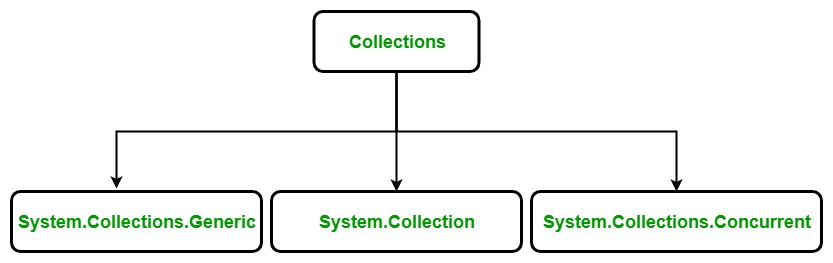

# To'plamlar

To'plamlar sizning dasturingizda ob'ektlar bilan ishlash usulini standartlashtiradi. Boshqacha qilib aytganda, to'plamlar bu - elementlarni umumlashtirilgan tarzda o'z ichiga olgan sinflar to'plami desak ham bo'ladi. To'plamlar yordamida foydalanuvchi yangilash, o'chirish, qidirish, saralash, tartiblash va h.k. kabi bir nechta operatsiyalarni bajarishi mumkin.

C\# da to'plamlar bir nechta sinflarga \(class\) bo'linadi va eng ko'p ishlatilinadiganlarini quyida keltirganmiz:

### [ArrayList](https://docs.dot-net.uz/c-.net/basic/yuqori-daraja/toplamlar/arraylist)

### [List](https://docs.dot-net.uz/c-.net/basic/yuqori-daraja/toplamlar/list)

### [SortedList](https://docs.dot-net.uz/c-.net/basic/yuqori-daraja/toplamlar/sortedlist)

### [Dictionary](https://docs.dot-net.uz/c-.net/basic/yuqori-daraja/toplamlar/dictionary)

### [HashTable](https://docs.dot-net.uz/c-.net/basic/yuqori-daraja/toplamlar/hashtable)

### [Stack](https://docs.dot-net.uz/c-.net/basic/yuqori-daraja/toplamlar/stack)

### [Queue](https://docs.dot-net.uz/c-.net/basic/yuqori-daraja/toplamlar/queue)

