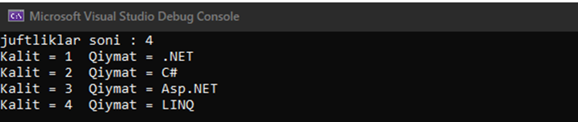
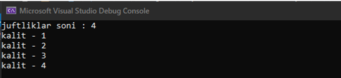
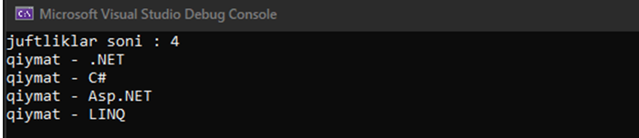
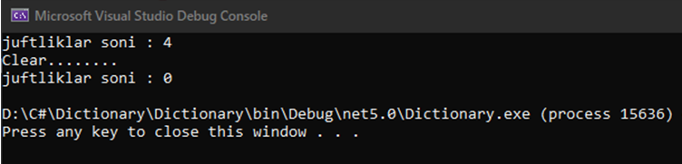
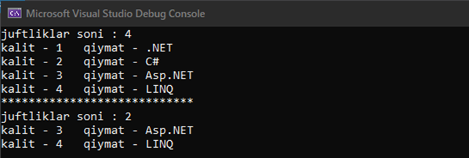

# Dictionary

**Dictionary** "TKey, TValue" shablonidagi klass bo'lib, **System.Collection.Generics** namespace sida joylashgan. **Dictionary** kalitlar va qiymatlar to'plami bo'lib, boshqa to'plamlar kabi kalit/qiymat ko'rinishida element qabul qiladi. **Hashtable** dan farqi, **Dictionary** da qidirish tizimi tezroq

```csharp
    using System.Collections.Generic;
```


**MUHIM QOIDALAR!**

• Kalitlar bir xil bo'lmasligi kerak

• Kalit null qiymat qabul qilmaydi


## Misol:

```csharp
     Dictionary<string, string> Mdic = new Dictionary<string, string>();

            Mdic.Add("1", ".NET");   //1 juftliklar soni
            Mdic.Add("2", "C#");     //2
            Mdic.Add("3", "Asp.NET");//3
            Mdic.Add("4", "LINQ");   //4

            Console.WriteLine($"juftliklar soni : {Mdic.Count}");

            foreach (var item in Mdic)
            {
                Console.WriteLine($"Kalit = {item.Key}  Qiymat = {item.Value}");
            }
```



```csharp
    Dictionary<string, string> Mdic = new Dictionary<string, string>();

            Mdic.Add("1", ".NET");   //1 juftliklar soni
            Mdic.Add("2", "C#");     //2
            Mdic.Add("3", "Asp.NET");//3
            Mdic.Add("4", "LINQ");   //4

            Console.WriteLine($"juftliklar soni : {Mdic.Count}");

            Dictionary<string, string>.KeyCollection KColl = Mdic.Keys;

            foreach (var item in KColl)
            {
                 Console.WriteLine($"kalit - {item}");
     }
```



```csharp
    Dictionary<string, string> Mdic = new Dictionary<string, string>();

            Mdic.Add("1", ".NET");   //1 juftliklar soni
            Mdic.Add("2", "C#");     //2
            Mdic.Add("3", "Asp.NET");//3
            Mdic.Add("4", "LINQ");   //4

            Console.WriteLine($"juftliklar soni : {Mdic.Count}");

            Dictionary<string, string>.ValueCollection VColl = Mdic.Values;

            foreach (var item in VColl)
            {
                Console.WriteLine($"qiymat - {item}");
            }
```



```csharp
   static void Main(string[] args)
        {
            Dictionary<string, string> Mdic = new Dictionary<string, string>();

            Mdic.Add("1", ".NET");   //1 juftliklar soni
            Mdic.Add("2", "C#");     //2
            Mdic.Add("3", "Asp.NET");//3
            Mdic.Add("4", "LINQ");   //4

            Console.WriteLine($"juftliklar soni : {Mdic.Count}");

            Console.WriteLine("Clear........");
            Mdic.Clear(); // hamma elementlarni o`chirib yuboradi

            Console.WriteLine($"juftliklar soni : {Mdic.Count}");
        }
```



```csharp
    static void Main(string[] args)
        {
            Dictionary<string, string> Mdic = new Dictionary<string, string>();

            Mdic.Add("1", ".NET");   //1 juftliklar soni
            Mdic.Add("2", "C#");     //2
            Mdic.Add("3", "Asp.NET");//3
            Mdic.Add("4", "LINQ");   //4

            Console.WriteLine($"juftliklar soni : {Mdic.Count}");

            foreach (var item in Mdic)
            {
                Console.WriteLine($"kalit - {item.Key}   qiymat - {item.Value}");
            }

            Console.WriteLine("****************************");

            Mdic.Remove("1"); //kaliti 1 ga teng bo`lgan juftlikni o`chirib tashlaydi
            Mdic.Remove("2"); //kaliti 2 ga teng bo`lgan juftlikni o`chirib tashlaydi

            Console.WriteLine($"juftliklar soni : {Mdic.Count}");

            foreach (var item in Mdic)
            {
                Console.WriteLine($"kalit - {item.Key}   qiymat - {item.Value}");
            }
        }
```



