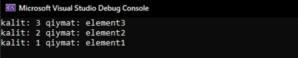
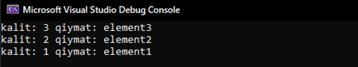
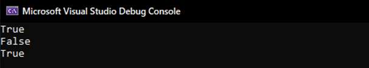

# HashTable

Bu mavzuni boshlashdan oldin Hash kod va Hash jadval haqida bilib olsak !

Hash kod – Ma'lumotlar to'plamida qidiruv va kiritishga yordam beruvchi, hash jadvalga asoslangan raqamli qiymat.

Hash jadval – bu kalit/qiymat elementlarni saqlash uchun maxsus to'plam. Stack, Array, List va Queue ni o'rniga Hash jadval 2 xil qiymat saqlaydi (kalit va qiymat). 

**Hashtable** – Hash kodga asoslangan, kalit/qiymat ko'rinishidagi juft elementlar to'plami. Boshqacha qilib aytganda, Hashtable ma'lumotlarni saqlash uchun hash jadvaldan foydalanadi (hash table). Hashtable (non-generic) generic bo'lmagan to'plamdir, shu sababdan kodni yuqorisiga System.Collections ni yozish kifoya.


**MUHIM QOIDALAR!**
  •	Hashtable kaliti null qiymatli bo'lishi mumkin emas
  •	Hashtable elementlari kalit/qiymat juftligida bo'ladi
  •	Kalitni nomi boshqa kalitlar bilan bir xil bo'lmasligi kerak


### Hashtable ni qanday yaratamiz ?

**1-Bosqich.** Kod yuqorisiga using System.Collections; kiritamiz
```csharp
    using System.Collections.Generic;
```
**2-Bosqich.** Ko'rsatilgan tartibda **Hashtable** ni yaratamiz
```csharp
    Hashtable hashtable_nomi = new Hashtable();
```
  hashtable_nomi – bu Hashtable nomi ixtiyoriy nom yozishingiz mumkin

**3-Bosqich.** Element qo'shamiz, har doimgidek 2 xil usulda :)
  1)	Hashtable ni yaratiboq element qo'shing (xuddi massivdek)
 ```csharp
    Hashtable hashtable_nomi = new Hashtable() {{1, "element1"}, {2, "element2"}};
 ``` 
  2)	Add() funksiyasi yordamida element qo'shing
 ```csharp
     Hashtable hashtable_nomi = new Hashtable();
        hashtable_nomi.Add(1, "element1");
        hashtable_nomi.Add(2, "element2");
        hashtable_nomi.Add(3, "element3");
 ``` 

 ### Misol:
 ```csharp
  using System;
  using System.Collections;
  public class Program
  {
      public static void Main()
      {
         Hashtable hashtable_nomi = new Hashtable();
         hashtable_nomi.Add(1, "element1");
         hashtable_nomi.Add(2, "element2");
          hashtable_nomi.Add(3, "element3");
          foreach (DictionaryEntry t in hashtable_nomi)
          {
              Console.WriteLine($"kalit: {t.Key} qiymat: {t.Value}");
          }
      }
  }
```


  DictionaryEntry haqida SortedList mavzusidagi misollar davomida ma'lumot berib o'tilgan.

 ### Hashtable da elementlarni qanday o'chiramiz ?
  **Remove()** va **Clear()** funksiyalari orqali

  **Remove()** – funksiyasidan foydalanib kalitni kiritish orqali elementlarni o'cherish mumkin
  **Clear()** –  funksiyasi **Hashtable** dagi barcha elementlarni o'cherish uchun


 ### Misol:
 ```csharp
  using System;
  using System.Collections;
  public class Program
  {
      public static void Main()
      {
         Hashtable hashtable_nomi = new Hashtable();
         hashtable_nomi.Add(1, "element1");
         hashtable_nomi.Add(2, "element2");
         hashtable_nomi.Add(3, "element3");
         hashtable_nomi.Remove(2);
         foreach (DictionaryEntry t in hashtable_nomi)
          {
              Console.WriteLine($"kalit: {t.Key} qiymat: {t.Value}");
         }
          Console.WriteLine("*********************************");
          hashtable_nomi.Clear();
          foreach (DictionaryEntry t in hashtable_nomi)
          {
              Console.WriteLine($"kalit: {t.Key} qiymat: {t.Value}");
          }
      }
  }
  ```
  

  ### Hashtable elementlarni bor yoki yo'qligini qanday bilamiz?

  **Contains()** – funksiyasi Hashtableda bizga kerakli kalit bor yoki yo'qligini tekshriadi
  **ContainsKey()** – Contains() bilan bir xil
  **ContainsValue()** – funksiyasi Hashtableda bizga kerakli qiymat bor yoki yo'qligini tekshiradi

 ### Misol:
 ```csharp
  using System;
  using System.Collections;
  public class Program
  {
      public static void Main()
      {
          Hashtable hashtable_nomi = new Hashtable();
          hashtable_nomi.Add(1, "element1");
          hashtable_nomi.Add(2, "element2");
          hashtable_nomi.Add(3, "element3");
          Console.WriteLine(hashtable_nomi.Contains(1));
          Console.WriteLine(hashtable_nomi.ContainsKey(6));
          Console.WriteLine(hashtable_nomi.ContainsValue("element3"));
      }
  }
```
  

  **True** bo'lganini sababi Hashtable kaliti 1 ga teng bo'lgan elementi bor
  **False** bo'lganini sababi kaliti 6ga teng bo'lgan elementi yo'q
  True bo'lganini sababi Hashtable ni qiymati "element3" ga teng bo'lgan elementi bor


