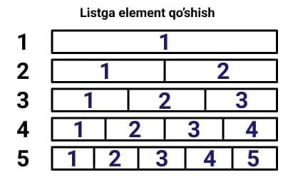
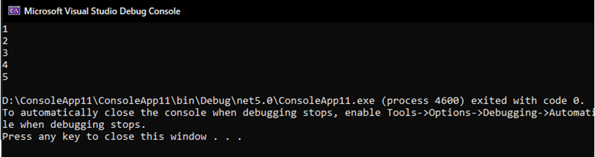
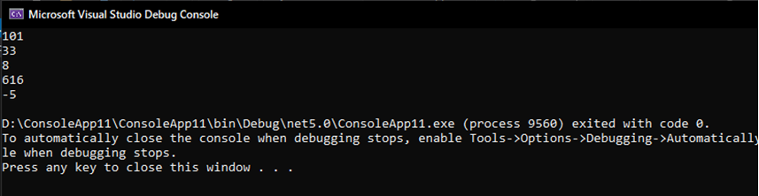
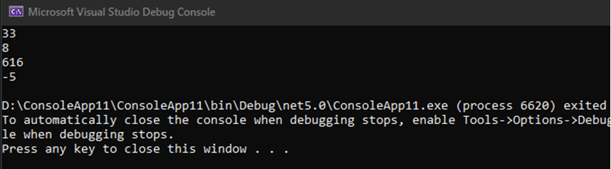
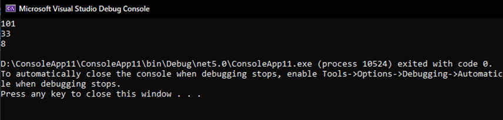
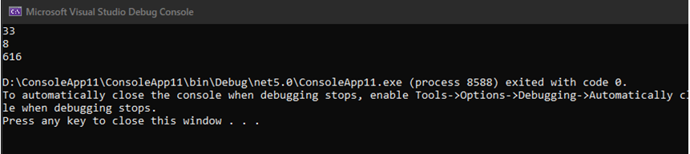
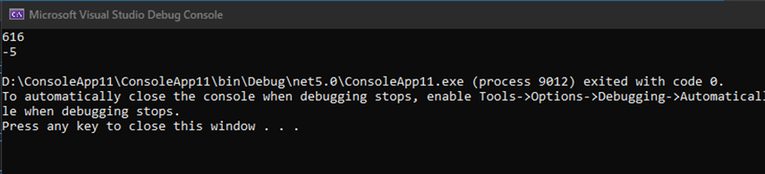
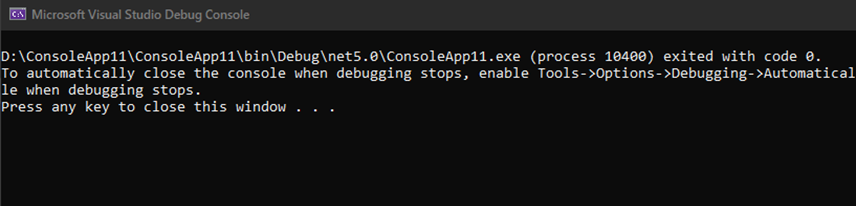
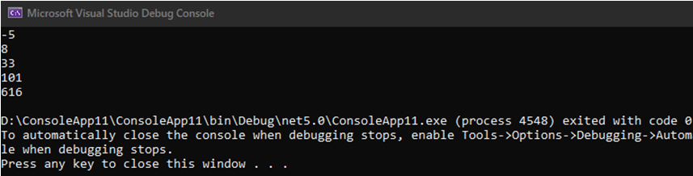

# LIST

**List** - elementlarni va obyektlarni saqlashga moslashgan to'plam. Bu to'plamga **List** deb nom berilishiga sabab, ro'yxatlar bilan qulay ishlash mumkin (tarjimasidan bilib olsa bo'ladi). Ro'yxatda nima qilishimiz mumkin, elementlarni ixtiyoriy joyga qo'shish yoki ixtiyoriy joyidan o'chirib tashlash va tartiblash (sort) funksiyasi borligi bilan boshqa to'plamlardan ajralib turadi. 


**MUHIM QOIDALAR!**
-	List elementlari null qiymat qabul qilishi mumkin
-	Elementlari qiymati bir xil bo'lishi mumkin
-	Elementlari [0] indeksdan boshlanadi


### List ni qanday yaratish mumkin?

**1-Bosqich.** Kod yuqorisida using System.Collections.Generic; ni kiritib o'tamiz

```csharp

    using System.Collections.Generic;
    
```

**2-Bosqich.** List<T> shabloni yordamida Listni yaratamiz
  
```csharp
    
   /* List<tipi> List_nomi = new List<tipi>(); 

           tipi = int, float, string, char........ */

           List<int> my_list = new List<int>();
    
```
  
**3-Bosqich.** Element qo`shamiz
    
  Element qo`shishning ikki yo'li mavjud:
    
   1) Xuddi massivdek, Listni yaratgan zahotingiz elementlarini kiritib qo'yishingiz mumkin
    
 ```csharp
    List<int> my_list = new List<int>() { 1, 2, 3, 4, 5 };
 ```
    
   2) Add() va AddRange() funksiyasi yordamida ham element qo`shish mumkin
    
    **Add()**
    
```csharp        
    List<int> my_list = new List<int>();
        my_list.Add(1);
        my_list.Add(2);
        my_list.Add(3);
        my_list.Add(4);
     my_list.Add(5);
```
       
    
  Elementlar shu tarzda birin ketin joylashib boradi
   
   **AddRange()**
```csharp
    List<int> my_list = new List<int>();
        my_list.Add(1);
        my_list.Add(2);
        my_list.Add(3);

        int[] array = new int[2];
        array[0] = 4;
        array[1] = 5;

        my_list.AddRange(array);

        foreach(int value in my_list)
            Console.WriteLine(value);
```
    
    
    Listda **foreach** ni quyidagi usulda ham ishlatish mumkin
```csharp
    my_list.ForEach(a => Console.WriteLine(a));
```
    Yoki o`zimizni dehqoncha usul ham bor :) 
```csharp
   for (int a = 0; a < my_list.Count; a++)
        {
            Console.WriteLine(my_list[a]);
        }
```  
   
    ### Listga misollar:
                                     
```csharp
       using System;
       using System.Collections.Generic;
       class Program
        {
             static void Main(string[] args)
             {
                 List<int> my_list = new List<int>();
                    my_list.Add(101);
                    my_list.Add(33);
                    my_list.Add(8);
                    my_list.Add(616);
                    my_list.Add(-5);


                 my_list.ForEach(a => Console.WriteLine(a));
            }
       }
```                                  
   
    
 ### Listni yaratishga yaratib oldik. Endi elementlarni qanday o`chiramiz?
    Remove(), RemoveAll(), RemoveAt(), RemoveRange(), Clear() funksiyalari yordamida misollar yozamiz
    
    **Remove(T)**- birinchi uchragan T elementni o`chiradi. T ni o`rnida Listdagi o`chirmoqchi bo`lgan element qiymatini yozamiz
```csharp
    List<int> my_list = new List<int>();
        my_list.Add(101);
        my_list.Add(33);
        my_list.Add(8);
        my_list.Add(616);
        my_list.Add(-5);


        my_list.Remove(101); // my_listdan 101 ni o`chiradi

        foreach (var value in my_list)
        {
            Console.WriteLine(value);
        }
```
   
    
    **RemoveAll(x=> x==T)** – Listdagi barcha T ga teng bo`lgan elementlari o`chiradi
```csharp
    List<int> my_list = new List<int>();
        my_list.Add(101);
        my_list.Add(33);
        my_list.Add(8);
        my_list.Add(616);
        my_list.Add(616);


        my_list.RemoveAll(x => x == 616); //my_listdan barcha 616 ni o`chiradi

        foreach (var value in my_list)
        {
            Console.WriteLine(value);
        }
```
   
    
    **RemoveAt(index)** - index ni joyiga, Listdagi qaysi elementni o`chirmoqchi bo`lsak, o`sha elementni indeksini yozamiz
```csharp
   List<int> my_list = new List<int>();
        my_list.Add(101);   //0
        my_list.Add(33);    //1
        my_list.Add(8);     //2
        my_list.Add(616);   //3
        my_list.Add(-5);    //4


        my_list.RemoveAt(0); //101 ni o`chiradi, chunki indeksi [0]

        my_list.RemoveAt(3); //-5 ni o`chiradi chunki indeksi [3]

        foreach (var value in my_list)
            Console.WriteLine(value); 
```
   
    
    Bu yerda so'rashingiz mumkin (-5) ni o'cherish uchun nega indeksini 3 yozdik, axir indeksi 4 ku? Ha to'g'ri (-5) qiymatli elementni indeksi 4 edi. Ammo 0-indeksdagi (101)ni o'chirganimizdan so'ng elementlari qaytda indekslanadi shunda:
```csharp
        my_list.Add(33);    //0
        my_list.Add(8);     //1
        my_list.Add(616);   //2
        my_list.Add(-5);    //3 
```
    (-5) ning indeksi 3 bo'lib qoladi. Endi esa (-5)ni o'cherish uchun indeksiga 3 yozishimiz kerak bo'ladi.
    
    **RemoveRange(index,index)** – bu funksiya qaysi elementdan qaysi elementga o'chirish kerakligini anglatadi
```csharp
   List<int> my_list = new List<int>();

        my_list.Add(101);   //0
        my_list.Add(33);    //1
        my_list.Add(8);     //2
        my_list.Add(616);   //3
        my_list.Add(-5);    //4


        my_list.RemoveRange(0, 3);

        foreach (var value in my_list)
          Console.WriteLine(value); 
```
    Bu yerda 0-indeksdan 3-indeksgacha o'chiriladi (101,33,8). Ammo 3-indeksdagi o'chmaydi(616). Natijada: 616 va -5 qoladi.
    
   
    
    **Clear()**- bu funksiya Listdagi barcha qiymatlarni o'chirib tashlaydi
    
```csharp
   List<int> my_list = new List<int>();

        my_list.Add(101);   //0
        my_list.Add(33);    //1
        my_list.Add(8);     //2
        my_list.Add(616);   //3
        my_list.Add(-5);    //4


        my_list.Clear();

        foreach (var value in my_list)
        Console.WriteLine(value); 
```
    Hamma element o'chib ketgandan keyin, hech narsa qolmaydi
    
   
    
    ### Listni qanday tartiblash mumkin?
    
    **Sort()**- funksiyasi avtomatik tariblab beradi
```csharp
   List<int> my_list = new List<int>();

        my_list.Add(101);   //0
        my_list.Add(33);    //1
        my_list.Add(8);     //2
        my_list.Add(616);   //3
        my_list.Add(-5);    //4


        my_list.Sort();

        foreach (var value in my_list)
        Console.WriteLine(value); 
```
    Kichikdan kattaga qarab tartiblanadi
   
