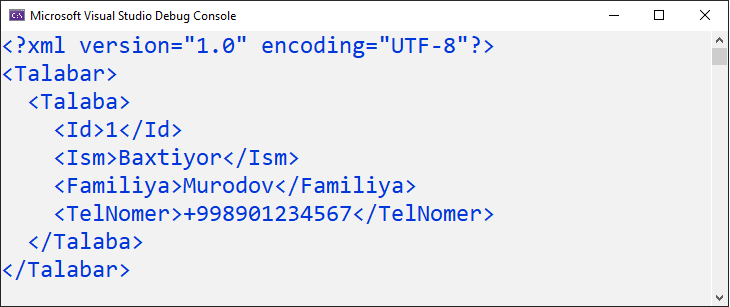
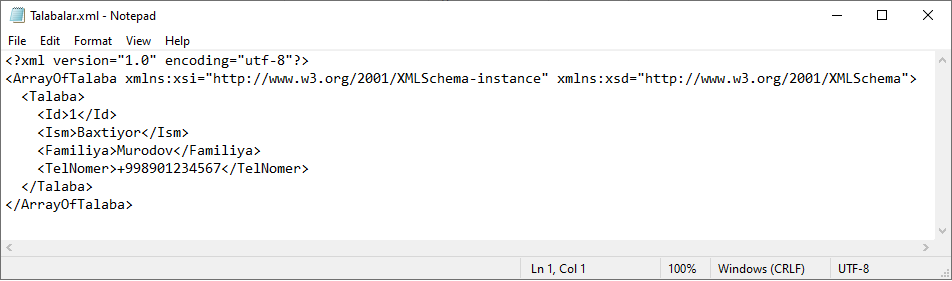

# XML Document bilan ishlash

**XML** \(e**X**tensible **M**arkup **L**anguage\) - kengaytirilgan markerlash tili degan ma'noni anglatadi va SGML \(**S**tandard **G**eneralized **M**arkup **L**anguage\) standart umumlashtirilgan markerlash tilidan olingan matnga asoslangan markerlash tilidir.


**XML** teglari HTML teglari kabi ma'lumotlarni ko'rsatish uchun ishlatilmaydi. Aksincha, **XML** - ma'lumotlarni saqlash va tartibga solish uchun ishlatiladi. Yaqin kelajakda **XML** HTML o'rnini bosmaydi, lekin u HTML ning ko'plab muvaffaqiyatli xususiyatlarini qo'llash orqali yangi imkoniyatlarni ochib beradi.


**XML** hujjatlar bilan ishlash uchun C\# dasturlash tilida [**System.Xml**](https://docs.microsoft.com/en-us/dotnet/api/system.xml?view=net-5.0) nomlar fazosidagi asosan quyidagi sinflardan foydalaniladi:

* [**XmlDocument**](https://docs.microsoft.com/en-us/dotnet/api/system.xml.xmldocument?view=net-5.0)
* [**XmlConvert**](https://docs.microsoft.com/en-us/dotnet/api/system.xml.xmlconvert?view=net-5.0)
* [**XmlNode**](https://docs.microsoft.com/en-us/dotnet/api/system.xml.xmlnode?view=net-5.0)
* [**XmlNodeList**](https://docs.microsoft.com/en-us/dotnet/api/system.xml.xmlnodelist?view=net-5.0)
* [**XmlScheme**](https://docs.microsoft.com/en-us/dotnet/api/system.xml.xmlscheme?view=net-5.0)
* [**XmlReader**](https://docs.microsoft.com/en-us/dotnet/api/system.xml.xmlreader?view=net-5.0)
* [**XmlTextReader**](https://docs.microsoft.com/en-us/dotnet/api/system.xml.xmltextreader?view=net-5.0)
* [**XmlWriter**](https://docs.microsoft.com/en-us/dotnet/api/system.xml.xmlwriter?view=net-5.0)
* [**XmlTextWriter**](https://docs.microsoft.com/en-us/dotnet/api/system.xml.xmltextwriter?view=net-5.0)

**Keling endi gapni cho'zmasdan amaliyotga o'tamiz. Quyida biz XML hujjat hosil qilishning bir nechta usullarini ko'rib chiqamiz.**

_Jarayonda biz Talaba modelidan tuzilgan Talabalar jadvalidan foydalanamiz:_

```csharp
public class Talaba
    {
        public int Id { get; set; }
        public string Ism { get; set; }
        public string Familiya { get; set; }
        public string TelNomer { get; set; }
    }
```

## 1. [**XmlDocument**](https://docs.microsoft.com/en-us/dotnet/api/system.xml.xmldocument?view=net-5.0) va [**XmlNode**](https://docs.microsoft.com/en-us/dotnet/api/system.xml.xmlnode?view=net-5.0) sinflari yordamida:

**XmlDocument** sinfidan yangi obyekt hosil qilamiz:

```csharp
XmlDocument document = new XmlDocument();
```

**XmlNode** sinfi orqali Xml hujjat parametrlarini hosil qilamiz va uni AppendChild metodi yordamida document ga qo'shamiz:

```csharp
XmlNode xnode = document.CreateXmlDeclaration("1.0", "UTF-8", null);
document.AppendChild(xnode);
```

Xml da yangi element hosil qilish XmlNode sinfining CreateElement metodi, elementga qiymat berish uchun esa CreateTextNode metodidan foydalanamiz.

Talabalar nomli bosh elementni yaratamiz va uni documentga qo'shamiz:

```csharp
XmlNode talabalar = document.CreateElement("Talabar");
document.AppendChild(talabalar);
```

Endi Talaba modelining xususiyatlarini element shaklida tashkil qilgan Talaba nomli element hosil qilamiz:

```csharp
XmlNode talaba = document.CreateElement("Talaba");
talabalar.AppendChild(talaba);

XmlNode id = document.CreateElement("Id");
id.AppendChild(document.CreateTextNode("1"));
talaba.AppendChild(id);

XmlNode ism = document.CreateElement("Ism");
ism.AppendChild(document.CreateTextNode("Nodirbek"));
talaba.AppendChild(ism);

XmlNode familiya = document.CreateElement("Familiya");
familiya.AppendChild(document.CreateTextNode("Abdulaxadov"));
talaba.AppendChild(familiya);

XmlNode nomer = document.CreateElement("TelNomer");
nomer.AppendChild(document.CreateTextNode("+998901234567"));
talaba.AppendChild(nomer);
```

Yaratgan Xml hujjatimizni saqlaymiz:

```csharp
document.Save("Talabalar.xml");
```

**Natijamiz:**



## 2. [**XmlWriter**](https://docs.microsoft.com/en-us/dotnet/api/system.xml.xmlwriter?view=net-5.0) sinfi yordamida:


XmlWriter sinfining metodlari:
* Create - Yangi hujjat obyektini yaratish
* WriteStartDocument - Yangi hujjat yozishni boshlash
* WriteStartElement - Yangi element ochish
* WriteValue - Element qiymatini kiritish
* WriteEndElement - elementni yopish
* WriteEndDocument - hujjatni yopish
* Flush - hujjatni saqlash


XmlWriter sinfining metodlaridan va yuqoridagi model va ketma-ketlikdan foydalanib yangi Talabalar.xml nomli hujjat hosil qilamiz.

**XmlWriter** sinfidan yangi obyekt hosil qilish uchun dastlab uning sozlamalarini hosil qilish kerak bo'ladi:

```csharp
XmlWriterSettings settings = new XmlWriterSettings();
settings.Indent = true;
```

XmlWriter obyektini Talabalar.xml fayli nomi va yuqoridagi settings bilan hosil qilamiz:

```csharp
XmlWriter writer = XmlWriter.Create("Talabalar.xml", settings);
```

Talaba modelining xususiyatlarini kiritib, hujjatimizni hosil qilamiz:

```csharp
writer.WriteStartDocument();
writer.WriteStartElement("Talabalar");

writer.WriteStartElement("Talaba");

writer.WriteStartElement("Id");
writer.WriteValue("1");
writer.WriteEndElement();

writer.WriteStartElement("Ism");
writer.WriteValue("Baxtiyor");
writer.WriteEndElement();

writer.WriteStartElement("Familiya");
writer.WriteValue("Murodov");
writer.WriteEndElement();

writer.WriteStartElement("TelNomer");
writer.WriteValue("+998901234567");
writer.WriteEndElement();

writer.WriteEndDocument();
writer.Flush();
```

## 3. **XML** hujjat hosil qilish uchun C\# dasturlash tilida [**System.Xml.Linq**](https://docs.microsoft.com/en-us/dotnet/api/system.xml.linq?view=net-5.0) nomlar fazosidagi [**XElement**](https://docs.microsoft.com/en-us/dotnet/api/system.xml.linq.xelement?view=net-5.0) sinfidan ham foydalansak bo'ladi:

Va nihoyat men yoqtirgan usulga ham yetib keldik 😄!


**XElement** sinfi yordamida XML hujjat hosil qilish birmuncha oson va tushunarli. Har bir element va uning ichidagi elementlar shajaraga o'xshab joylashadi.


```csharp
XElement talabalar =
    new XElement("Talabalar",
        new XElement("Talaba",
            new XElement("Id", "1"),
            new XElement("Ism", "Baxtiyor"),
            new XElement("Familiya", "Murodov"),
            new XElement("Tel_nomer", "+998901234567")));

    talabalar.Save("Talabalar.xml");
```

## 4. **XML** hujjatni JSON fayllar kabi [Serialize](https://docs.microsoft.com/en-us/dotnet/csharp/programming-guide/concepts/serialization/) qilish orqali ham yaratishimiz mumkin. Buning uchun bizga [**System.Xml.Serialization**](https://docs.microsoft.com/en-us/dotnet/api/system.xml.serialization?view=net-5.0) nomlar fazosidagi sinflar kerak bo'ladi.

Dastlab Talaba modelimizga [Serializable] attributini qo'shishimiz kerak bo'ladi:

```csharp
[Serializable]
public class Talaba
    {
        public int Id { get; set; }
        public string Ism { get; set; }
        public string Familiya { get; set; }
        public string TelNomer { get; set; }
    }
```

Yangi Talaba obyektini xususiyatlari bilan yaratamiz va Talabalar listiga qo'shamiz:

```csharp
Talaba talaba = new Talaba
        {
            Id = 1,
            Ism = "Baxtiyor",
            Familiya = "Murodov",
            TelNomer = "+998901234567"
        };
        
List<Talaba> talabalar = new List<Talaba>();
talabalar.Add(talaba);
```

Obyektimizni serialize qilamiz va TextWriter yordamida Talabalar.xml nomi bilan saqlaymiz:

```csharp
XmlSerializer serializer = new XmlSerializer(typeof(List<Talaba>));
TextWriter twriter = new StreamWriter("Talabalar.xml");

serializer.Serialize(twriter, talabalar);
twriter.Close();

```

**Natijamiz:**



_Qachondir davomi bor yana ;)_
