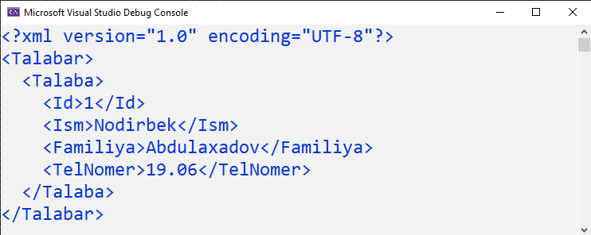

# XML Document bilan ishlash

**XML** \(e**X**tensible **M**arkup **L**anguage\) - kengaytirilgan markerlash tili degan ma'noni anglatadi va SGML \(**S**tandard **G**eneralized **M**arkup **L**anguage\) standart umumlashtirilgan markerlash tilidan olingan matnga asoslangan markerlash tilidir.


**XML** teglari HTML teglari kabi ma'lumotlarni ko'rsatish uchun ishlatilmaydi. Aksincha, **XML** - ma'lumotlarni saqlash va tartibga solish uchun ishlatiladi. Yaqin kelajakda **XML** HTML o'rnini bosmaydi, lekin u HTML ning ko'plab muvaffaqiyatli xususiyatlarini qo'llash orqali yangi imkoniyatlarni ochib beradi.


**XML** hujjatlar bilan ishlash uchun C\# dasturlash tilida [**System.Xml**](https://docs.microsoft.com/en-us/dotnet/api/system.xml?view=net-5.0) nomlar fazosidagi asosan quyidagi sinflardan foydalaniladi:

* [**XmlDocument**](https://docs.microsoft.com/en-us/dotnet/api/system.xml.xmldocument?view=net-5.0)
* [**XmlConvert**](https://docs.microsoft.com/en-us/dotnet/api/system.xml.xmlconvert?view=net-5.0)
* [**XmlNode**](https://docs.microsoft.com/en-us/dotnet/api/system.xml.xmlnode?view=net-5.0)
* [**XmlNodeList**](https://docs.microsoft.com/en-us/dotnet/api/system.xml.xmlnodelist?view=net-5.0)
* [**XmlScheme**](https://docs.microsoft.com/en-us/dotnet/api/system.xml.xmlscheme?view=net-5.0)
* [**XmlReader**](https://docs.microsoft.com/en-us/dotnet/api/system.xml.xmlreader?view=net-5.0)
* [**XmlTextReader**](https://docs.microsoft.com/en-us/dotnet/api/system.xml.xmltextreader?view=net-5.0)
* [**XmlWriter**](https://docs.microsoft.com/en-us/dotnet/api/system.xml.xmlwriter?view=net-5.0)
* [**XmlTextWriter**](https://docs.microsoft.com/en-us/dotnet/api/system.xml.xmltextwriter?view=net-5.0)

**Keling endi gapni cho'zmasdan amaliyotga o'tamiz. Quyida biz XML hujjat hosil qilishning bir nechta usullarini ko'rib chiqamiz.**

_Jarayonda biz Talaba modelidan tuzilgan Talabalar jadvalidan foydalanamiz:_

``csharp
public class Talaba
    {
        public int Id { get; set; }
        public string Ism { get; set; }
        public string Familiya { get; set; }
        public string TelNomer { get; set; }
    }
``

## 1. [**XmlDocument**](https://docs.microsoft.com/en-us/dotnet/api/system.xml.xmldocument?view=net-5.0) va [**XmlNode**](https://docs.microsoft.com/en-us/dotnet/api/system.xml.xmlnode?view=net-5.0) sinflari yordamida:

**XmlDocument** sinfidan yangi obyekt hosil qilamiz:

``csharp
XmlDocument document = new XmlDocument();
``

**XmlNode** sinfi orqali Xml hujjat parametrlarini hosil qilamiz va uni AppendChild metodi yordamida document ga qo'shamiz:

``csharp
XmlNode xnode = document.CreateXmlDeclaration("1.0", "UTF-8", null);
document.AppendChild(xnode);
``

Xml da yangi element hosil qilish **XmlNode** sinfining CreateElement metodi, elementga qiymat berish uchun esa CreateTextNode metodidan foydalanamiz.

Talabalar nomli bosh elementni yaratamiz va uni documentga qo'shamiz:

``csharp
XmlNode talabalar = document.CreateElement("Talabar");
document.AppendChild(talabalar);
``

Endi Talaba modelining xususiyatlarini element shaklida tashkil qilgan Talaba nomli element hosil qilamiz:

``csharp
XmlNode talaba = document.CreateElement("Talaba");
talabalar.AppendChild(talaba);

XmlNode id = document.CreateElement("Id");
id.AppendChild(document.CreateTextNode("1"));
talaba.AppendChild(id);

XmlNode ism = document.CreateElement("Ism");
ism.AppendChild(document.CreateTextNode("Nodirbek"));
talaba.AppendChild(ism);

XmlNode familiya = document.CreateElement("Familiya");
familiya.AppendChild(document.CreateTextNode("Abdulaxadov"));
talaba.AppendChild(familiya);

XmlNode nomer = document.CreateElement("TelNomer");
nomer.AppendChild(document.CreateTextNode("+998901234567"));
talaba.AppendChild(nomer);
``

Yaratgan Xml hujjattimizni saqlaymiz:

``csharp
document.Save("Talabalar.xml");
``

**Natijamiz:**

