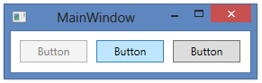
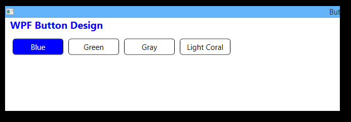

# XAML nima?


XAML kengaytmasi **Extensible Application Markup Language** bo'lib, Microsoftning grafik interfeysni qo'llovchi XML varianti. WinForms kabi avvalgi GUI framework larda, grafik interfeys uchun yozayotgan kod Visual Studioning dizayner qismida boshqarilgan, lekin XAML bilan Microsoft boshqacha yo'lni tutdi. Huddi HTML kabi grafik interfeysni loyihalashingiz va o'zgartirishingiz mumkin.

Bu yerda XAML ni batafsil yoritmaymiz, va uni qanday qilib ishlatishni to'la tushuntirishga harakat qilamiz, chunki u WPF ning eng asosiy qismi xisoblanadi. Window yoki Page yasayapsizmi farqi yo'q, ular XAML dokumenti va alohida faylda kodi bo'ladi va birgalikda Window/Page juftligini hosil qiladi. XAML fayli barcha elementlari bilan grafik interfeysni hosil qilsa, ortidagi kod barcha hodisalar va XAML kontrollarini boshqaradi

## Basic XAML

XAML da qanday qilib boshqaruvni yaratamiz? XAML da boshqarusvni yaratish burchakli qavslar bilan o'ralgan holda, uning nomini yozishmiz kerak masalan Button quyidagicha ko'rinadi.

```markup
<Button> </Button> Yoki <Button />
```

Ko'pchilik boshqarish vositalari tarkibni boshlang'ich va oxirgi teglar orasiga joylashtirishga imkon beradi, undan keyin boshqaruv mazmuni. Masalan, Button boshqaruvi sizga boshlang'ich va oxirgi teglar orasida matnni ko'rsatishga imkon beradi

```markup
<Button>A button</Button>
```

HTML katta kichik harflarni farqlamaydi lekin XAML da farq qiladi, chunki boshqaruv nomi .NET framework doirasidagi turga mos kelishi kerak. Xuddi shu narsa boshqaruvning xususiyatlariga mos keladigan atribut nomlari uchun ham qo'llaniladi. Tegga atributlar qo'shish orqali bir nechta xususiyatlarni aniqlash mumkin. M: button:

```markup
<Button FontWeight="Bold" Content="A button" />
```

Biz **FontWeight** xususiyatini o'rnatdik, unga qalin matnni qo'ydik, va keyin matnni boshlash va tugatish tegi orasida yozish bilan bir xil bo'lgan **Content** xususiyatini o'rnatdik. Biroq, boshqarishning barcha atributlari quyidagicha belgilanishi mumkin, bunda ular Control-Dot-Property (< Boshqaruv>.\<Xususiyat >) yozuvidan foydalanib, asosiy boshqaruvning farzand teglari ko'rinishida paydo bo'ladi: (Farzand tegi degani boshqaruv elementi ichida yangi \<boshqaruv>.\<xususyat> e'lon qilish)

```markup
<Button>

    <Button.FontWeight>Bold</Button.FontWeight>

    <Button.Content>A button</Button.Content>

</Button>
```

Natija yuqoridagi bilan bir xil, ularni faqat sintaksis bilan farqlash mumkin. Deylik boshqarish elementmiz ko'pi matndan tashkil topgan bo'lsa, TextBlock boshqarish elementni farzand qilib foydalanishmiz mumkin. Misol, bitta tugmachada turli xil rangdagi matnlar joylashgan bo'lsa TextBlock-Boshqaruv elementdan farzand sifadiza foydalanshimiz mumkin. Bu qoydalarni boshqa boshqaruv elementlari uchun ham qo'lasak bo'ladi.

```markup
<Button>

    <Button.FontWeight>Bold</Button.FontWeight>

    <Button.Content>

        <WrapPanel>

            <TextBlock Foreground="Blue">Multi</TextBlock>

            <TextBlock Foreground="Red">Color</TextBlock>

            <TextBlock>Button</TextBlock>

        </WrapPanel>

    </Button.Content>

</Button>
```

Content xossasi faqat bitta farzand elementiga ruxsat beradi, shuning uchun biz turli xil rangdagi matn bloklarini o'z ichiga olgan holda WrapPaneldan foydalanamiz.WrapPanel Panellar singari qo'lanladi, WPFda muhim rol o'ynaydi va biz ularni keyinroq batafsilroq muhokama qilamiz - hozir ularni faqat boshqa boshqaruv elementlari uchun konteyner sifatida ko'rib chiqamiz.

## **Code vs XAML**

Umid qilamanki, yuqoridagi misollarda siz XAMLni yozish juda oson ekanligini ko'rdingiz, lekin buni amalga oshirishning turli xil usullari mavjudligini va agar siz yuqoridagi misolda turli rangdagi matnli tugmachani olish uchun ko'p sonli markirovka deb o'ylasangiz, unda harakat qilib ko'ring. uni C# tilida xuddi shu narsani bajarish bilan taqqoslang:

```csharp
Button btn = new Button();
btn.FontWeight = FontWeights.Bold;

WrapPanel pnl = new WrapPanel();

TextBlock txt = new TextBlock();
txt.Text = "Multi";
txt.Foreground = Brushes.Blue;
pnl.Children.Add(txt);

txt = new TextBlock();
txt.Text = "Color";
txt.Foreground = Brushes.Red;
pnl.Children.Add(txt);

txt = new TextBlock();
txt.Text = "Button";
pnl.Children.Add(txt);

btn.Content = pnl;
pnlMain.Children.Add(btn)
```

> Vazifa:Ushbu Button larni uziz mustaqil bajaring




