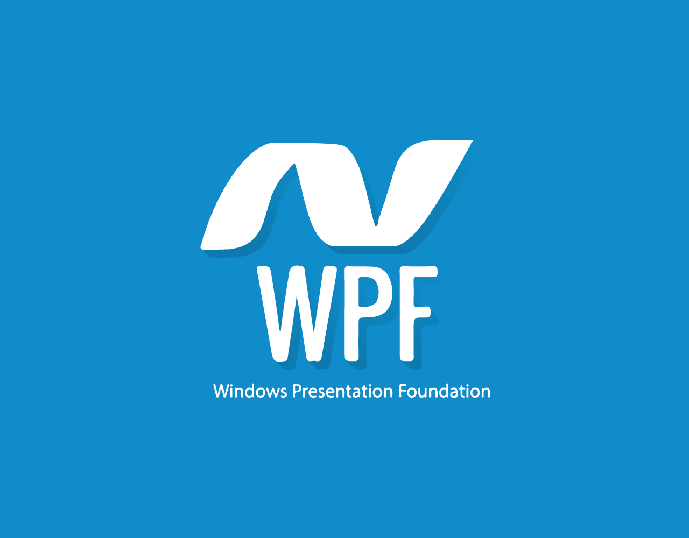

# WPF oynasi



WPF dasturini yaratishda birinchi bo'lib Window klassi uchraydi. U oynaning ildizi bo'lib xizmat qiladi va sizga standart chegara, sarlavha satrini va tugmalarni kattalashtirish, kichraytirish va yopish bilan ta'minlaydi. WPF oynasi - bu  elementi ildiz bo'lgan XAML \(.xaml\) faylining va CodeBehind \(.cs\) faylining kombinatsiyasi. Agar siz Visual Studio \(Express\) dan foydalanayotgan bo'lsangiz va siz yangi WPF dasturida ishlayotgan bo'lsangiz, u siz uchun standart oynani yaratadi, bu quyidagicha ko'rinadi:

```markup
<Window x:Class="WpfApplication1.Window1"

    xmlns="http://schemas.microsoft.com/winfx/2006/xaml/presentation"

    xmlns:x="http://schemas.microsoft.com/winfx/2006/xaml"

    Title="Window1" Height="300" Width="300">

    <Grid>

    </Grid>

</Window>
```

Window1 klassi qisman deb belgilanadi, chunki u ish vaqtida sizning XAML fayli bilan birlashtirilib, sizga to'liq oynani beradi. Bu aslida InitializeComponent \(\) ga murojat qiladi, shuning uchun to'liq ishlaydigan oynani ishga tushirish kerak:

```csharp
using System;
using System.Windows;
using System.Windows.Controls;
//…more using statements
namespace WpfApplication1
{
    /// <summary>
    /// Interaction logic for Window1.xaml
    /// </summary>
    public partial class Window1 : Window
    {
        public Window1()
        {
            InitializeComponent();
        }
    }
}
```

Agar biz XAML fayliga qaytsak, siz Window elementida, shuningdek sarlavha kabi bir nechta boshqa qiziqarli atributlarni ko'rasiz, u oynaning sarlavhasini \(sarlavha satrida ko'rsatilgan\) va boshlang'ich kengligi va balandligini belgilaydi.

Visual Studio biz uchun Grid boshqaruvini Oyna ichida yaratganini ham ko'rasiz. Grid WPF panellaridan biri bo'lib, u har qanday panel yoki boshqaruv elementi bo'lishi mumkin bo'lsa-da. Keyinchalik ushbu qo'llanmada biz foydalanishingiz mumkin bo'lgan har xil turdagi panellarni batafsilroq ko'rib chiqamiz, chunki ular WPF-da juda muhim.

## Muhim oyna xususiyatlari

WPF Window sinfi sizning dastur oynangizning ko'rinishini va xatti-harakatlarini boshqarish uchun o'rnatishingiz mumkin bo'lgan juda ko'p qiziqarli atributlarga ega. Eng qiziqarlilarining qisqacha ro'yxati:

*  **Icon**_**-**Odatda, oyna sarlavhasining chap tomonida, yuqori chap burchakda ko'rsatiladigan oynaning belgisini belgilashga imkon beradi._
* **ResizeMode** - Bu oxirgi foydalanuvchi sizning oynangizning o'lchamlarini o'zgartirishi yoki o'zgarmasligini boshqaradi.
* **CanResize** - foydalanuvchiga boshqa oynalar singari o'lchamlarini kattalashtirish / kichraytirish tugmalari yordamida yoki qirralarning birini sudrab o'zgartirish imkoniyatini beradi.
* **CanMinimize** - foydalanuvchiga oynani kichraytirishga imkon beradi, lekin uni kattalashtirish yoki kattaroq yoki kichraytirish uchun emas.
* **NoResize** - bu eng qat'iy, bu erda kattalashtirish va kamaytirish tugmalari olib tashlanadi va oynani kattaroq yoki kichikroq tortib bo'lmaydi.
*  **ShowInTaskbar** - Standart qiymat to'g'ri, ammo agar siz uni "false" ga qo'ysangiz, oynangiz Windows vazifalar panelida ko'rsatilmaydi. Birlamchi bo'lmagan oynalar ichiga kichraytirishi kerak bo'lgan ilovalar uchun foydalidir.
* **SizeToContent** - Oynaning o'lchamini avtomatik ravishda tarkibiga ,moslashtirishi uchun o'lchamini o'zgartirish to'g'risida qaror qabul qiling. Odatiy holda Manual, ya'ni oyna avtomatik ravishda o'lchamini o'zgartirmaydi. Boshqa variantlar Width, Height va WidthAndHeight bo'lib, ularning har biri avtomatik ravishda oynaning o'lchamini gorizontal, vertikal yoki ikkalasida o'rnatadi.
* **WindowStartupLocation** - oynangizning dastlabki holatini boshqaradi . Odatiy bo'lib Manual, ya'ni oyna dastlab sizning oynangizning Top va Left xususiyatlariga muvofiq joylashadi. Boshqa variantlar - bu CenterOwner, bu oynani egasining oynasining o'rtasiga joylashtiradi va CenterScreen, bu oynani ekranning o'rtasiga joylashtiradi.
* **WindowState** - dastlabki oyna holatini **boshqaradi** . U Oddiy, maksimallashtirilgan yoki minimallashtirilgan bo'lishi mumkin. Odatiy - oddiy, bu sizning derazangizni kattalashtirish yoki kichraytirishni xohlamasangiz, uni ishlatishingiz kerak.

