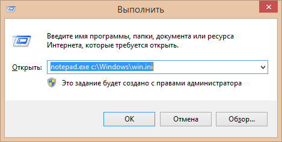
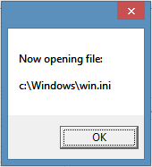
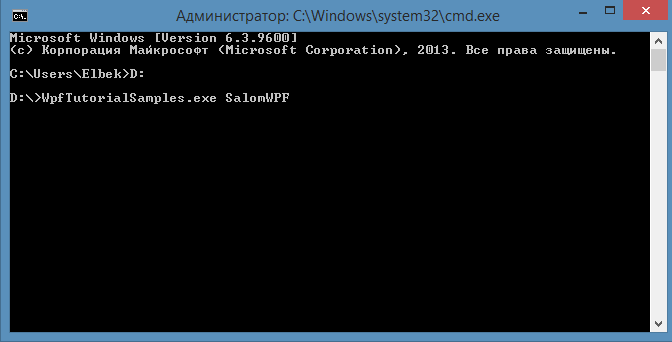
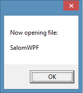

# Argument berish

Buyruq satrining parametrlari siz ishlashini ma'lum tarzda o'zgartirish \(belgilash\) uchun, siz ishlatmoqchi bo'lgan dasturga parametrlar to'plamini yuborish uchun qo'llaniladi. Masalan, tahrirlovchi\(notepad\) da faylni ochish. Siz Windowsga o'rnatilgan Notepad muharririni quyidagicha ishga tushirishga urinib ko'rishingiz mumkin \(**Buyruqlar satrini** ishga tushiring yoki **Win+R** kombinatsiyasini bosing\):

> Sizga **Buyruqlar satri** ishga tushdi. Endi unga quyidagi buyruqni yozamiz:

> > _**notepad.exe c:\Windows\win.ini**_



 Ushbu buyruq **win.ini** faylini tahrirlovchi\(**notepad.exe**\)da ochadi \(agar u boshqa joyda joylashgan bo'lsa, **win.ini** ga yo'lni o'zgartirishingiz kerak bo'ladi\). Bloknot unga o'tkazilgan parametrlarni ko'rib chiqadi \(ushbu holatda bitta parametr berilyapdi\) va ulardan foydalanadi. Yani biz **notepad.exe** dasturini ishga tushuryapmiz va unga parametr sifatida **win.ini** beryapmiz, shunda **notepad.exe** dasturi "_**c:\Windows"**_ manzilida joylashgan **win.ini** faylini ochadi.


Siz o'zinggizni WPF dasturingizga ham boshlangich parametrlarni berishingiz mumkin. Ularni App.xaml ga beramiz.


 Demak **WpfTutorialSamples** dasturini yaratamiz va **App.xaml** ilovasiga o'tamiz. **StartupUri** hodisasini **Startup** hodisasiga o'zgartiramiz. So'ng eng birinchi ochiladigan oyna **MainWindow.xaml** ni **Application\_Startup**\(yangi yaratadigan metodimiz\) ga o'zgartiramiz. Bu bilan biz **Application\_Startup** metodi **MainWindow** oynasi yuklanishidan oldin ishlashini ko'rsatgan bo'lamiz.

```markup
<Application x:Class="WpfTutorialSamles.App"
             xmlns="http://schemas.microsoft.com/winfx/2006/xaml/presentation"
             xmlns:x="http://schemas.microsoft.com/winfx/2006/xaml"
             StartUp="Application_SartUp">
     <Application.Resources></Application.Resources>
</Application>
<!--             Bu App.xaml ilovasi                          -->
```

 Ishni **App.xaml.cs** ilovasida davom ettiramiz. Tepada aytib o'tkanimizdek **Application\_Startup** metodini yaratamiz:

```csharp
private void Application_StartUp(object sender, StartUpEventArgs e)
{
    MainWindow wnd = new MainWindow();
    if (e.Args.Length == 1)
      MessageBox.Show("Now opening file: \n\n" + e.Args[0]);
    wnd.Show();
}
//            Application_StartUp metodi
```

Demak metodni tahlil qiladigan bo'lsak:

> > **MainWindow** turida yangi **wnd** o'zgaruvchisi elon qilinmoqda;
>
> > Buyruqlar satridan kelgan parametrlar sonini 1 ga teng ekani tekshirilib. Kelgan Argumentni **MessageBox \(**xabar ko'rinishi\) da _**"**Now opening file:"_ satridan so'ng yangi qatorga chiqarish buyurilyapdi.

```csharp
using System;
using System.Collections.Generic;
using System.Windows;

namespace WpfTutorialSamples
{
    public partial class App : Application
    {
        MainWindow wnd = new MainWindow();
        if (e.Args.Length == 1)
            MessageBox.Show("Now opening file: \n\n" + e.Args[0]);
        wnd.Show();
    }
{
//            App.xaml.cs ilovasi
```

 Endi dasturimiz tayyor uni ishga tushursangiz hech qanday hodisa ro'y bermaydi. Sababi biz unga boshlang'ich qiymat bermadik. Uni testlash uchun **Visual Studio** ni mavjud bo'lgan buyruqlar satrini ishlatsak bo'ladi:

 Yuqoridagi menyuda **\[Проект\]** ni tanlaymiz, keyin **Свойства: \[Dastur nomi\]** bo'limiga kiramiz. Ochilgan oynadan  **Отладка** bo'limini tanlaymiz:

![\[&#x421;&#x432;&#x43E;&#x439;&#x441;&#x442;&#x432;&#x430;\] bo&apos;limi](../../../.gitbook/assets/wpf11.png)

 **Buyruqlar satri qiymatlari** uchun ajratilgan\(qizil chiziqda belgilangan\) hududga kerakli buyruqni yozamiz. Yozilgan buyruq matn sifatida qabul qilinadi va xabar sifatida ekranga chiqadi:  




 Endi dasturimizni **Buyruqlar satri** dan ishga tushiramiz va unga **Parametr** sifatida "SalomWPF" matnini beramiz:  
 **Buyruqlar satri** ga dasturimizni joylashgan joyi va nomini ko'rsatamiz va bitta bo'sh joy qoldiramiz. Chunki **Buyruqlar satri** Parametrlarni sonini aynan shu bo'sh joylarga qarab aniqlaydi.

> > D:\WpfTutorialSamples.exe SalomWPF





