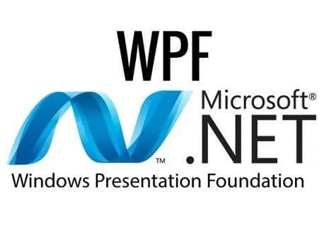
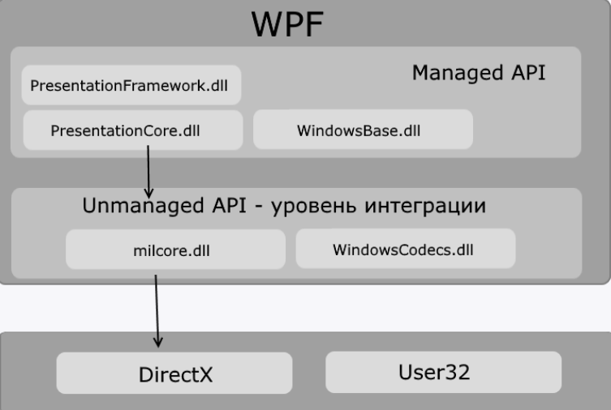

# WPF ga kirish

WPF \(Windows Presentation Foundation\) .NET platformasining grafik interfeyslarni yaratishga mo'ljallangan texnologiyasi hisoblanadi.

### WPF ning afzalliklari:

* _WPF \(Windows Presentation Foundation\) texnologiyasi .NET platformasining bir qismidir va grafik interfeyslarni yaratish uchun quyi tizimdir._
* _Agar WinForms-ga asoslangan an'anaviy ilovalarni yaratishda boshqaruv va grafiklarni chizish uchun Windows OS ning user32 va GDI + kabi qismlari javob bersa, WPF ilovalari DirectX-ga asoslangan. Bu WPF grafik ko'rsatish asosiy xususiyati hisoblanadi: WPF yordamida, yana bir muhim qismi oddiy tugmalar va murakkab 3D - modellar kabi grafik chizishdir._
* _Muhim qismlardan biri XML - ga asoslangan XAML interfeysining deklarativ belgilash tilidan foydalanishdir: interfeysning deklarativ e'lonini yoki boshqariladigan C\# tillarida kodni ishlatib, boy grafik interfeysni yaratishingiz mumkin._

Diagrammada ko'rib turganingizdek, WPF ikki darajaga bo'linadi: boshqariladigan API va boshqarilmaydigan API \(DirectX integratsiya darajasi\). Boshqariladigan API umumiy til runtime, .NET - umumiy til Runtime ostida ishlaydigan kodni o'z ichiga oladi. Ushbu API WPF platformasining asosiy funksiyalarini tasvirlaydi va quyidagi tarkibiy qismlardan iborat:

1. PresentationFramework.dll: grafik interfeysni qurishda foydalanish mumkin bo'lgan komponentlar va boshqaruvlarning barcha asosiy ilovalarini o'z ichiga oladi.
2. PresentationCore.dll: PresentationFramework.dll da sinflar uchun barcha tayanch turlarini o'z ichiga oladi.
3. WindowsBase.dll: WPF-da qo'llaniladigan bir qator yordamchi sinflarni o'z ichiga oladi, lekin ma'lum bir platformadan tashqarida ham foydalanish mumkin.
4. Unmanaged API DirectX bilan yuqori darajali integratsiya qilish uchun ishlatiladi:
5. milcore.dll: WPF komponentlarini DirectX bilan integratsiyalashuvini ta'minlaydi. Ushbu komponent DirectX bilan ishlash uchun boshqarilmaydigan kodda \(C/C++\) yoziladi.
6. WindowsCodecs.dll: WPF-da tasvirlar uchun past darajadagi qo'llab-quvvatlovchi kutubxona.
7. Operatsion tizimning tarkibiy qismlari va DirectX, ilovaning tarkibiy qismlarini vizualizatsiya qilishni yoki boshqa past darajadagi ishlov berishni amalga oshirishni ham o'z ichiga oladi.

