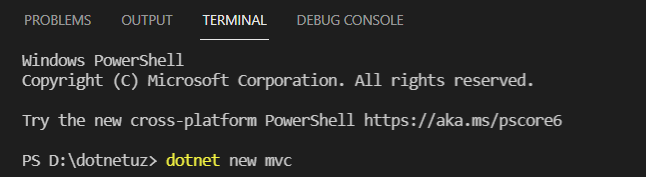

# Loyiha struktruasi

Loyiha yaratish uchun dastlab D: diskda **dotnetuz** nomli papka yaratamiz so\'ng va bu papkani vs code dasturi orqali kiramiz. MVC turidagi loyiha yaratish uchun terminalga kirib \( ctrl + ` \) ushbu kommandalarni kiritamiz:

**dotnet new mvc**

Natijada ushbu loyiha shabloni dotnet tomonidan yaratilib beriladi.

/Controllers papkasi- Controller sinfdan voris olgan barcha controllerlarni saqlaydi.
/Models papkasi- C# sinflaridan iborat bo\'lgan modellarni o'zida saqlaydi.
/Properties papkasi- MVC loyihaning asosiy xususiyatlari va IIS,Kestrel sozlamalaridan iborat bo'ladi.
/Views papkasi- Viewlarni o'zida saqlaydi.
/wwwroot papkasi- statik fayllarni yani css,js va kutubxonalar jquery,bootstrap... 
appsettings.json- barcha muhitlar uchun dastlabki sozlarmalar joylashadiga fayl.
appsettings.{Muhit_nomi}.json- faqat {Muhit_nomi} da ko\'rsatilgan muhit uchun sozlamalar.
{loyiha_nomi}.csproj- Loyihaning asosiy sozlamalar fayli.
Program.cs- Dastlabki ishga tushuvchi fayl.
Startup.cs- MVC loyihaning service larni, middleware larni va asosiy sozlamalarni o'zida jamlovchi Program.cs fayl tomonidan chaqiriluvchi fayli.

