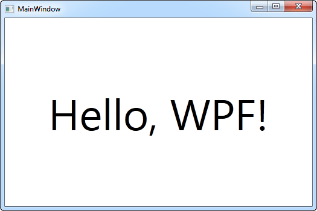

# Salom WPF

Har qanday dasturlash tilini o'rganganda ilk misol "Salom, dunyo!" matnini chiqarish bilan boshlanadi. Biz buni ozgina o'zgartiramiz-da, monitorda ko'rinadigan matnimizni "Salom, WPF" deb nomlaymiz. Maqsad, ishni boshlash qanchalik osonligini tushuntirish.

Ushbu qo'llanma sizda Visual Studio yoki Visual Studio Community talqini borligini nazarda tutadi. Agar boshqa biror IDE ishlatayotgan bo'lsangiz, ko'rsatmalarni o'zingiz ishlatayotgan dasturga moslashingiz kerak bo'ladi.

Visual Studio File menyusida New project. Chap tarafda bir nechta toifalarni ko'rish mumkin. Ushbu qo'llanma C\# tili va Windows ilovalarini nazarda tutgani uchun chap tomondagi ro'yxatdan Windows ni tanlang. Windows ilovalari turlari ro'yxati ochilgach, ro'yxatdan WPF Application ni tanlang. Name maydonida dastur nomini "SalomWPF" deb nomlaymiz. Barcha sozlamalar to'g'riligini tekshirib, Ok tugmasini bosing.

Dastur loyihangiz bir necha fayllardan iborat bo'ladi, lekin e'tiborni: MainWindow.xaml ga qaratamiz. Bu ilovani ishga tushganda ko'rinadigan oynasi, agar nomlarini o'zgartirmagan bo'lsangiz. Undagi XAML \(XAML haqida batafsil ma'lumotni keyingi darslarda beramiz\)kodi quyidagicha ko'rinishda bo'ladi:

```markup
<Window x:Class="WpfApplication1.MainWindow"

  xmlns="http://schemas.microsoft.com/winfx/2006/xaml/presentation"

  xmlns:x="http://schemas.microsoft.com/winfx/2006/xaml"

  Title="MainWindow" Height="350" Width="525">

  <Grid>

  </Grid>

</Window>
```

Bu Visual Studio tomonidan avtomatik yasalgan ilk XAML oyna. Shu holatda ilovani ishga tushirsa bo'ladi \(buning uchun menyu qatoridan Debug -&gt; Start Debugging ni tanlang yoki F5 tugmasini bosing\). Bo'sh oyna chiqqanini ko'rgan bo'lsangiz dastur muvaffaqaiyatli ishga tushgan bo'ladi, endi oynada biz bergan matnni chiqaramiz.

Grid paneliga TextBlock kontrolini qo'shamiz va unga avval eslab o'tilgan matnimizni joylaymiz:

```markup
<Window x:Class="WpfApplication1.MainWindow"

  xmlns="http://schemas.microsoft.com/winfx/2006/xaml/presentation"

  xmlns:x="http://schemas.microsoft.com/winfx/2006/xaml"

  Title="MainWindow" Height="350" Width="525">

  <Grid>

    <TextBlock HorizontalAlignment="Center" VerticalAlignment="Center" FontSize="72">

      Hello, WPF!

    </TextBlock>

  </Grid>

</Window>
```

Dasturni ishga tushirib ko'ring \(menyu qatoridan Debug-&gt; Start Debugging ni yoki F5 ni bosing\) va harakatlaringiz natijasi o'zingizning birinchi WPF ilovangizni tomosha qiling:



TextBlock kontrolida 3 xil atributlarni ishlatdik, bularning biri matnni markazda aks ettirish , FontSize esa matnni kattaroq shriftda olish uchun ishlatildi. Bularning barchasi haqida to'liq ma'lumotni keyingi darslarda o'rganamiz.


Shu yergacha yetib kelganingiz bilan tabriklaymiz! O'rganishda davom eting va tez orada WPF masteri bo'lib yetishing!


