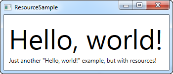
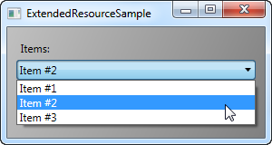
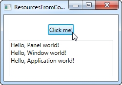

# Resurslar

WPF modeli juda qulay funktsiyalarni taqdim etadi, ma'lumotlarni boshqarish sifatida butun oyna uchun yoki butun dastur uchun global miqyosda resurs sifatida saqlay oladi. Ma'lumotlar hozirgi ma'lumotdan tortib, WPF element ierarxiyasiga qadar har qanday narsa bo'lishi mumkin. Bu sizga ma'lumotlarni bir joyga qo'yishga, so'ngra ularni turli joylarda ishlatishga imkon beradi.

```markup
<Window x:Class="WpfTutorialSamples.WPF_Application.ResourceSample"

        xmlns="http://schemas.microsoft.com/winfx/2006/xaml/presentation"

        xmlns:x="http://schemas.microsoft.com/winfx/2006/xaml"

        xmlns:sys="clr-namespace:System;assembly=mscorlib"

        Title="ResourceSample" Height="150" Width="350">

    <Window.Resources>

        <sys:String x:Key="strHelloWorld">Hello, world!</sys:String>

    </Window.Resources>

    <StackPanel Margin="10">

        <TextBlock Text="{StaticResource strHelloWorld}" FontSize="56" />

        <TextBlock>Just another "<TextBlock Text="{StaticResource strHelloWorld}" />" example, but with resources!</TextBlock>

    </StackPanel>

</Window>
```



WPF-dagi resurslar kalitga ega \(x: Key atributi\), bu dasturning istalgan qismidan StaticResource ifodasi bilan kalit yordamida murojaat qilishga imkon beradi. Ushbu misolda biz faqat satrni resurslarda saqlashni va uni ikki xil TextBlock elementlarida ishlatishni ko'rib chiqdik.

## Statik va Dinamik resurslar.

Yuqoridagi misollarda men manbalarga\(resursga\) murojaat qilish uchun StaticResource markup kengaytmasidan foydalandim, lekin DynamicResource ko'rinishida boshqa alternativ\(zaxira manba\) mavjud. Bu resurslarning asosiy farqi shundaki, statik resurslar \(StaticResource\) faqat bir marta, XAML fayli yuklanganda aniqlanadi. Agar keyinchalik dastur ishlayotganda resurslar o'zgartirilsa va statik bo'lsa, bu o'zgarishlar resurslarda aks etmaydi.

Boshqa tomondan, Dynamic Resources. Ular zarur bo'lgan vaqtda aniqlanishi mumkin, so'ngra ish vaqtida bekor qilinishi mumkin. Buni statik qiymatga bog'lash va qiymatni kuzatadigan va qiymat o'zgarganda sizga yuboradigan funktsiya uchun majburiy deb o'ylang. Shuningdek, dinamik manbalar dasturni ishlab chiqishda hali mavjud bo'lmagan manbalardan foydalanishga imkon beradi, masalan: dasturning boshida ushbu resurslarni CodeBehind-dan qo'shasiz.

## Resurslarning boshqa turlari

```markup
<Window x:Class="WpfTutorialSamples.WPF_Application.ExtendedResourceSample"

        xmlns="http://schemas.microsoft.com/winfx/2006/xaml/presentation"

        xmlns:x="http://schemas.microsoft.com/winfx/2006/xaml"

        xmlns:sys="clr-namespace:System;assembly=mscorlib"

        Title="ExtendedResourceSample" Height="160" Width="300"

        Background="{DynamicResource WindowBackgroundBrush}">

    <Window.Resources>

        <sys:String x:Key="ComboBoxTitle">Items:</sys:String>


        <x:Array x:Key="ComboBoxItems" Type="sys:String">

            <sys:String>Item #1</sys:String>

            <sys:String>Item #2</sys:String>

            <sys:String>Item #3</sys:String>

        </x:Array>


        <LinearGradientBrush x:Key="WindowBackgroundBrush">

            <GradientStop Offset="0" Color="Silver"/>

            <GradientStop Offset="1" Color="Gray"/>

        </LinearGradientBrush>

    </Window.Resources>

    <StackPanel Margin="10">

        <Label Content="{StaticResource ComboBoxTitle}" />

        <ComboBox ItemsSource="{StaticResource ComboBoxItems}" />

    </StackPanel>

</Window>


```



Yuqorida biz bir nechta qo'shimcha manbalarni qo'shdik, shunda bizning oynamiz endi qatorni, satrlar massivi va gradient cho'tkasini o'z ichiga oladi. String yorliq uchun ishlatiladi, satrlar massivi ComboBox elementlari va gradient cho'tkasi oynaning fonida ishlatiladi. Ko'rib turganingizdek, juda ko'p qiziqarli va turli xil narsalar manbalar sifatida saqlanishi mumkin.

## CodeBehind-dagi manbalar

Oldingi misolda biz qanday qilib turli xil joylarda resurslarni saqlashimiz mumkinligini ko'rdik, shuning uchun ushbu misolda biz har biri boshqa doirada saqlangan Code-back-dan uchta turli xil manbalarga murojaat qilamiz:

## **App.xaml:**

```markup
<Application x:Class="WpfTutorialSamples.App"

             xmlns="http://schemas.microsoft.com/winfx/2006/xaml/presentation"

             xmlns:x="http://schemas.microsoft.com/winfx/2006/xaml"

             xmlns:sys="clr-namespace:System;assembly=mscorlib"

             StartupUri="WPF application/ResourcesFromCodeBehindSample.xaml">

    <Application.Resources>

        <sys:String x:Key="strApp">Hello, Application world!</sys:String>

    </Application.Resources>

</Application>
```

## **Oyna:**

```markup
<Window x:Class="WpfTutorialSamples.WPF_Application.ResourcesFromCodeBehindSample"

        xmlns="http://schemas.microsoft.com/winfx/2006/xaml/presentation"

        xmlns:x="http://schemas.microsoft.com/winfx/2006/xaml"

        xmlns:sys="clr-namespace:System;assembly=mscorlib"

        Title="ResourcesFromCodeBehindSample" Height="175" Width="250">

    <Window.Resources>

        <sys:String x:Key="strWindow">Hello, Window world!</sys:String>

    </Window.Resources>

    <DockPanel Margin="10" Name="pnlMain">

        <DockPanel.Resources>

            <sys:String x:Key="strPanel">Hello, Panel world!</sys:String>

        </DockPanel.Resources>


        <WrapPanel DockPanel.Dock="Top" HorizontalAlignment="Center" Margin="10">

            <Button Name="btnClickMe" Click="btnClickMe_Click">Click me!</Button>

        </WrapPanel>


        <ListBox Name="lbResult" />

    </DockPanel>

</Window>
```

## **Code-back \(back-end\)**

```csharp
using System;
using System.Windows;

namespace WpfTutorialSamples.WPF_Application
{
 public partial class ResourcesFromCodeBehindSample : Window
 {
  public ResourcesFromCodeBehindSample()
  {
   InitializeComponent();
  }
  private void btnClickMe_Click(object sender, RoutedEventArgs e)
  {
   lbResult.Items.Add(pnlMain.FindResource("strPanel").ToString());

   lbResult.Items.Add(this.FindResource("strWindow").ToString());

   lbResult.Items.Add(Application.Current.FindResource("strApp").ToString());
  }
 }
}
```



Kod orqasida biz tugmachani bosish hodisasini boshqaramiz, unda har bir matn satrini ko'rinib turganidek, ListBox-ga qo'shamiz. Biz resursni ob'ekt sifatida qaytaradigan **FindResource\(\)** usulidan foydalanamiz \(agar topilgan bo'lsa\), keyin **ToString\(\)** usuli yordamida o'zimiz bilgan qatorga aylantiramiz.

**FindResource\(\)** usulini turli xil sohalarda qanday ishlatayotganimizga e'tibor bering - avval panelda, so'ngra oynada va keyin amaldagi Application ob'ektida. Resursni biz bilgan joydan qidirish mantiqan to'g'ri keladi, ammo yuqorida aytib o'tilganidek, agar manba topilmasa, qidiruv ierarxiyani rivojlantiradi, shuning uchun biz asosan paneldagi **FindResource\(\)** usulidan foydalanishimiz mumkin edi uchala holat ham, chunki agar u topilmasa, oynaga \(Window\) qadar va keyinchalik dastur darajasiga qadar davom etishi mumkin edi.

