# ASP.NET Core da birinchi telegram bot

Demak, ASP.NET Core da telegram bot bilan ishlashni boshlaymiz. Bot vazifalarini belgilash uchun bizga 2 ta asosiy narsa kerak bo'ladi:

1. Telegram Bot API bilan bog'lanish uchun **kalit\(token\)**
2. Editor \(kod yozishda bizga yordam beruvchi qurol\)

## Botfatherdan token olish

Token - bu Telegram Bot API ga so'rovlar yuborib, undan ma'lumotlar olish uchun kerak bo'ladigan kalit hisoblanadi. Bu tokenni birovga bildirmaslikni maslahat bergan bo'lardim, sababi token orqali siz yaratayotgan bot boshqariladi.

Tokenni olish uchun quyidagi qadamlarni bosib o'tishingiz kerak bo'ladi:

* Telegram dasturiga kirib, qidiruv sistemasiga **"botfather"** ko'rinishida murojaat qiling va quyida berilgan manzilga tashrif buyuring.

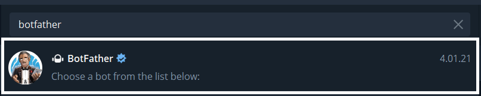

*  Berilgan komandalar orasidan, **/newbot** buyrug'ini tanlang.

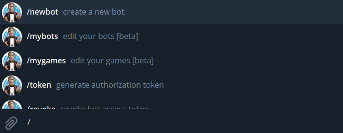

* So'ralgan savol tartibiga mos holda amallarni bajaring.

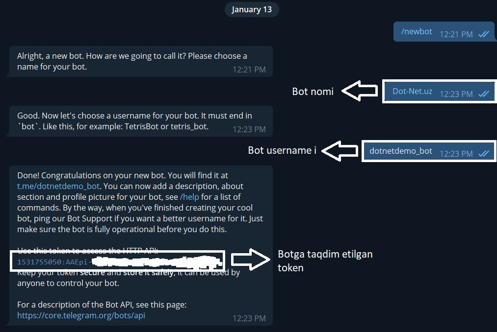

Tokenni qabul qilib oldik, endigi navbatda, bizga editor kerak bo'ladi. Ishlarimizni tartibli va qulay tarzda amalga oshirish uchun **Visual Studio** dasturidan foydalanamiz. Visual Studio dasturiga ASP.NET Core ni qanday o'rnatilinishi, hamda ASP.NET Core haqida foydali ma'lumotlarni ushbu [video](https://youtu.be/xj7aYUOw78w) orqali bilib olishingiz mumkin bo'ladi.

Agarda aytilgan barcha narsalarni o'rnatib olgan bo'lsangiz, unda botni tuzishga kirishamiz.

## Birinchi telegram bot

* Create a new project


* ASP.NET Core Web Application

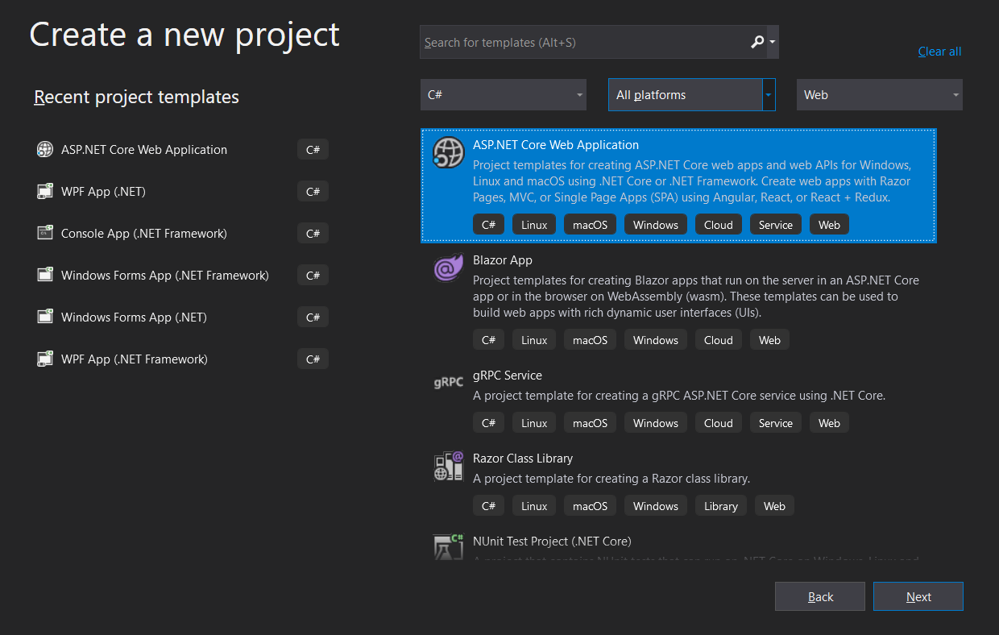

* Dasturga nom bering va unga joylashuvni taqdim eting

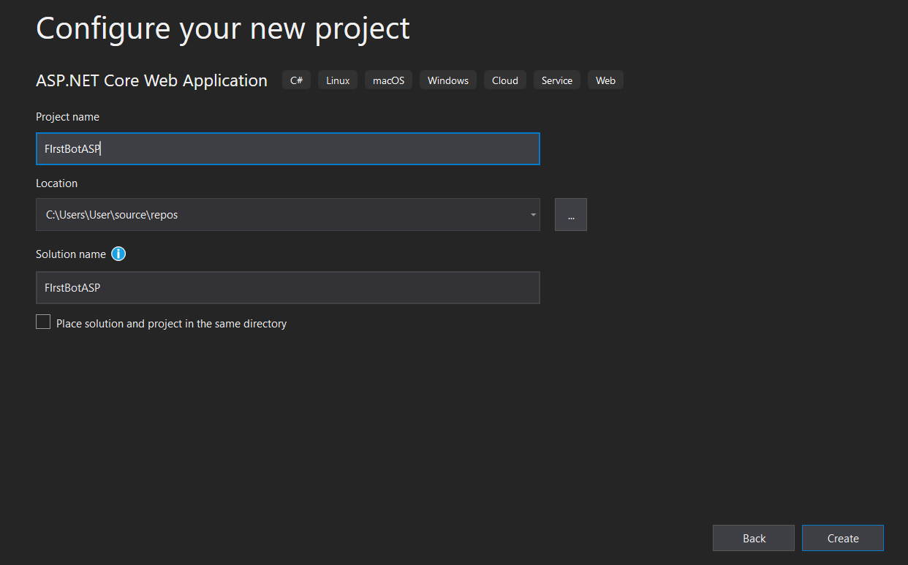

* ASP.NET Core Empty

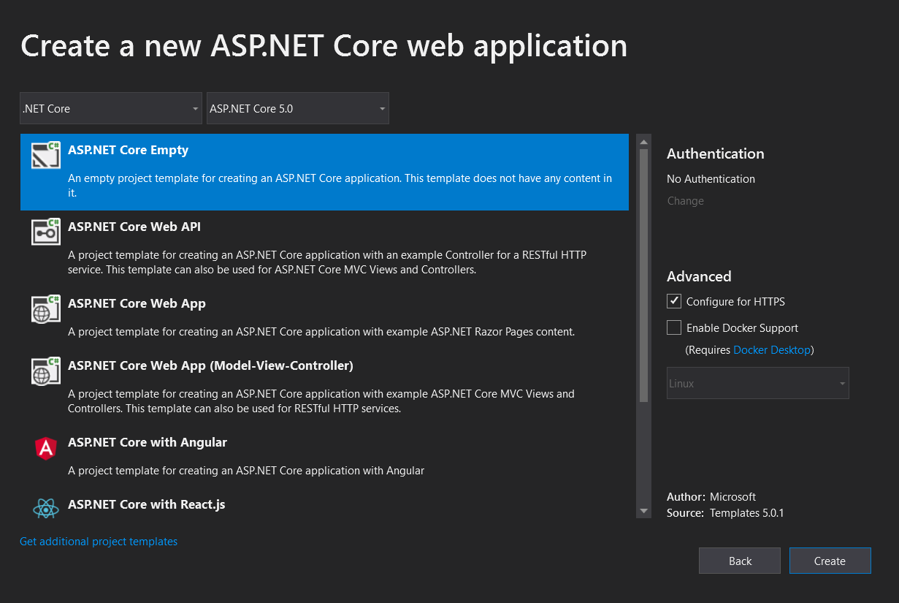

Yuqoridagi harakatlardan so'ng bizga, ASP.NET Core Empty project oynasi taqdim etiladi va loyihada default holatda quyidagi fayllar hosil qilinadi.

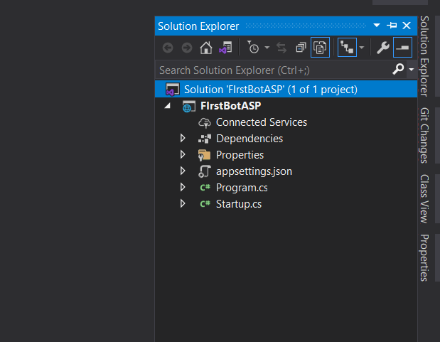

Telegram Bot API ga bog'lanish uchun bizga **Telegram.Bot** paketi kerak bo'ladi. Uni **Manage NuGet  Packages** bo'limi orqali dasturga qo'shib olamiz.

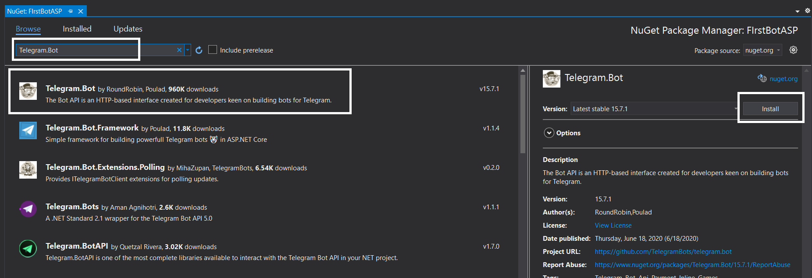

Galdagi qadamda dasturimizda Controllers papkasini yaratamiz va unga bo'sh MVC Controllerni qo'shamiz

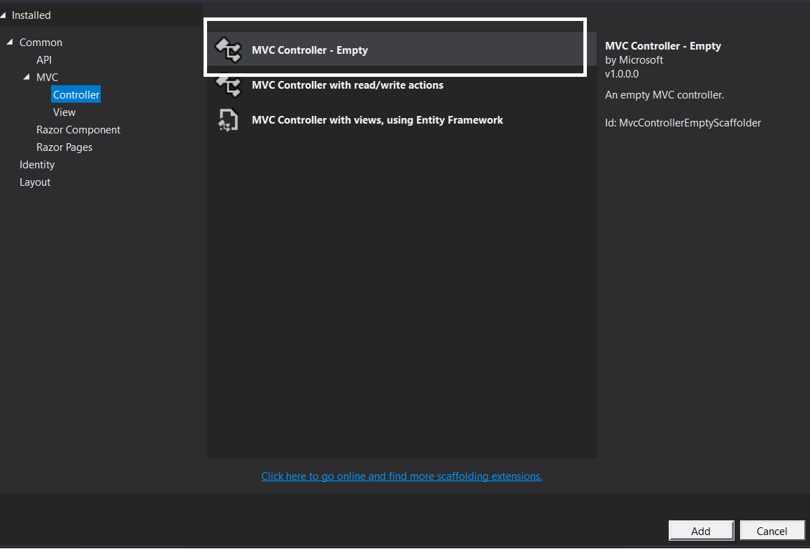

So'ngra bizga quyidagicha ko'rinish taqdim etiladi.

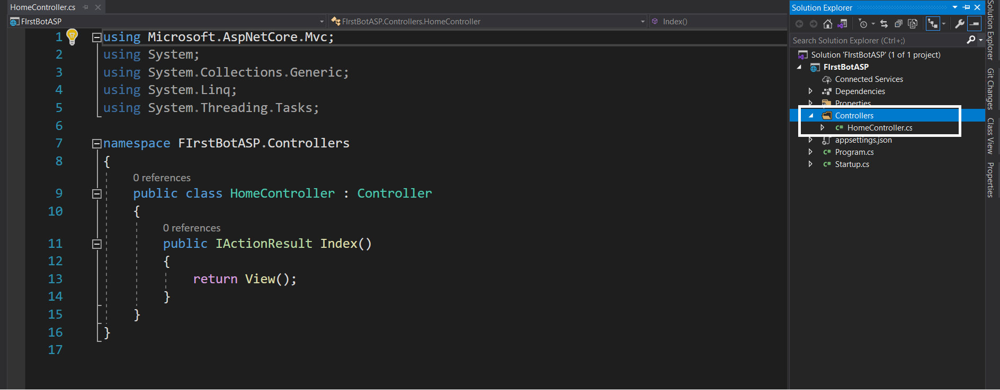

Endi botimiz vazifalarini shuyerda belgilaymiz.

```csharp
using Microsoft.AspNetCore.Mvc;
using Telegram.Bot;
using Telegram.Bot.Args;

namespace FIrstBotASP.Controllers
{
    public class HomeController : Controller
    {
        // TelegramBotClient sinfidan obyekt hosil qilamiz
        // va unga Botfather orqali olgan tokenni
        // bog'laymiz
        private TelegramBotClient client = new TelegramBotClient("1531755050:AAEpi-2sgSeqoP8E_DVEe0Csx0H8L1zBi2c");

        // HomePage
        public string Index()
        {
            // yangi event_handler yasaldi
            client.OnMessage += Xabar_Kelganda;

            // xabar kelishini tasdiqlash
            client.StartReceiving();
            
            // string qaytaradi  
            return "Bot hozr ishlamoqda";
        }

        // foydalanuvchu xabar yuborganda ishlaydi
        private async void Xabar_Kelganda(object sender, MessageEventArgs e)
        {
            // foydalanuvchi idsi
            long userId = e.Message.Chat.Id;
            
            // kelgan xabar idsi
            int msgId = e.Message.MessageId;

            if(e.Message.Text == "/start")
            {
                // xabar yuborish
                await client.SendTextMessageAsync(userId, "Assalomu alaykum", replyToMessageId: msgId);
            }
        }
    }
}

```

Web loyiha ishga tushgan paytda, botimiz ham birga ishlashligi uchun Startup.cs faylida, Controllerni qo'shib qo'yamiz.

```csharp
using Microsoft.AspNetCore.Builder;
using Microsoft.AspNetCore.Hosting;
using Microsoft.Extensions.DependencyInjection;
using Microsoft.Extensions.Hosting;

namespace FIrstBotASP
{
    public class Startup
    {
        // This method gets called by the runtime. Use this method to add services to the container.
        // For more information on how to configure your application, visit https://go.microsoft.com/fwlink/?LinkID=398940
        public void ConfigureServices(IServiceCollection services)
        {
            // yaratilingan controllerni qo'shish
            services.AddControllersWithViews();
        }

        // This method gets called by the runtime. Use this method to configure the HTTP request pipeline.
        public void Configure(IApplicationBuilder app, IWebHostEnvironment env)
        {
            if (env.IsDevelopment())
            {
                app.UseDeveloperExceptionPage();
            }

            app.UseRouting();

            app.UseEndpoints(endpoints =>
            {
                // urllar boshqaruvi 
                endpoints.MapControllerRoute(
                    name: "default",
                    pattern: "{controller=Home}/{action=Index}/");
            });
        }
    }
}


```

Bizning ASP.NET Core da yaratgan birinchi dasturimiz tayyor bo'ldi, endi uni yurgazsak ham bo'ladi.

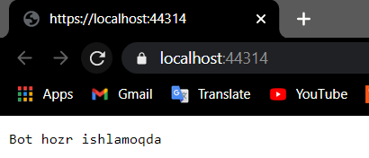

Dasturimiz localhostda muvaqqiyatli ishga tushdi. Endi yaratgan botimizga o'tib. **/start** komandasini yuboramiz.

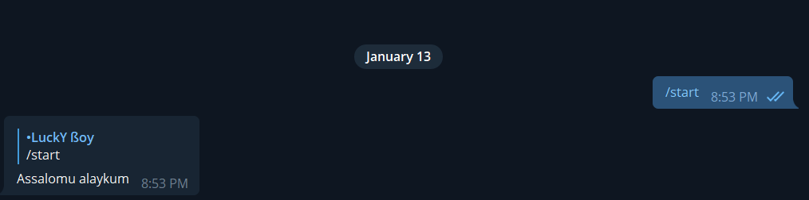

Suxbatni shu yerda to'xtamiz va Starter bo'limiga sayohatni boshlaymiz.


